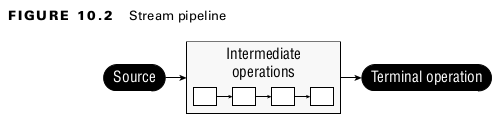
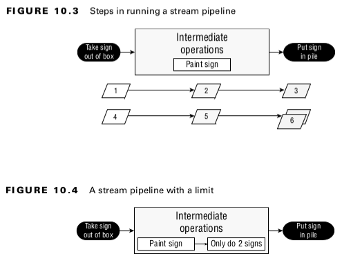
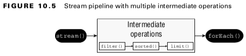

## Chapter 10 - Streams

### Optional
### Table 10.1 Common Optional instance methods
| Method                  | When Optional is empty                       | When Optional contains value | 
|-------------------------|----------------------------------------------|------------------------------|
| get()                   | Throws exception                             | Returns value                |  
| ifPresent(Consumer c)   | Does nothing                                 | Calls Consumer with value    |
| ifPresent()             | Returns false                                | Returns true                 |
| orElse(T other)         | Returns other parameter                      | Returns true                 |  
| orElseGet(Supplier s)   | Returns result of calling Supplier           | Returns value                | 
| orElseThrow()           | Throws NoSuchElementException                | Returns value                |
| orElseThrow(Supplier s) | Throws exception created by calling Supplier | Returns value                |
<br>

### Using Streams
- A ***stream*** in Java is a sequence of data. A stream pipeline consists of the operations that run on a stream to produce a result.
<br>

### Understanding the Pipeline Flow
- ***Source***: Where the stream comes from.
- ***Intermediate operations***: Transforms the stream into another one. There can be as few or as many intermediate operations as you’d like. Since streams use lazy evaluation, the intermediate operations do not run until the terminal operation runs.
- ***Terminal operation***: Produces a result. Since streams can be used only once, the stream is no longer valid after a terminal operation completes.
<br>


<br>

### Table 10.2 Intermediate vs terminal Operations
| Scenario                              | Intermediate operation | Terminal operation | 
|---------------------------------------|------------------------|--------------------|
| Required part of useful pipeline?     | No                     | Yes                |  
| Can exist multiple times in pipeline? | Yes                    | No                 |  
| Return type is stream type?           | Yes                    | No                 |  
| Executed upon method call?            | No                     | Yes                | 
| Stream valid after call?              | Yes                    | No                 |
<br>


<br>

#### Reviewing Stream Creation Methods
### Table 10.3 Creating a source
| Method                                         | Finite or Infinite? | Notes                                                                                                                                                    | 
|------------------------------------------------|---------------------|----------------------------------------------------------------------------------------------------------------------------------------------------------|
| Stream.empty()                                 | Finite              | Creates Stream with zero elements.                                                                                                                       |  
| Stream.of(varargs)                             | Finite              | Creates Stream with elements listed.                                                                                                                     |  
| coll.stream()                                  | Finite              | Creates Stream from Collection.                                                                                                                          |  
| coll.parallelStream()                          | Finite              | Creates Stream from Collection where the stream can run in parallel.                                                                                     | 
| Stream.generate(supplier)                      | Infinite            | Creates Stream by calling Supplier for each element upon request.                                                                                        |
| Stream.iterate(seed, unaryOperator)            | Infinite            | Creates Stream by using seed for first element and then calling UnaryOperator for each subsequent element upon request.                                  |
| Stream.iterate(seed, predicate, unaryOperator) | Finite or infinite  | Creates Stream by using seed for first element and then calling UnaryOperator for each subsequent element upon request. Stops if Predicate returns false |
<br>

#### Using Common Terminal Operations
- Reductions are a special type of terminal operation where all of the contents of the stream are combined into a single primitive or Object.
<br>

### Table 10.4 Terminal stream operations
| Method                                    | What happens for infinite streams | Return value      | Reduction |
|-------------------------------------------|-----------------------------------|-------------------|-----------|
| count()                                   | Does not terminate                | long              | Yes       |
| min() <br>max()                           | Does not terminate                | Optional&lt;T&gt; | Yes       |
| findAny() <br>findFirst()                 | Terminates                        | Optional&lt;T&gt; | No        |
| allMatch() <br>anyMatch() <br>noneMatch() | Sometimes Terminates              | boolean           | No        |
| forEach()                                 | Does not terminate                | void              | No        |
| reduce()                                  | Does not terminate                | Varies            | Yes       |
| collect()                                 | Does not terminate                | Varies            | Yes       |
<br>

### Using Common Intermediate Operations

#### Filtering
```
public Stream<T> filter(Predicate<? super T> predicate);
```
<br>

#### Removing Duplicates
- The ***distinct()*** method returns a stream with duplicate values removed.
<br>

#### Restricting by Position
```
public Stream<T> limit(long maxSize);
public Stream<T> skip(long n);
```
<br>

#### Mapping

- The map() method creates a one-to-one mapping from the elements in the stream to the elements of the next step in the stream.
```
public <R> Stream<R> map(Function<? super T, ? extends R> mapper);
```
<br>

#### Using flatMap
- The flatMap() method takes each element in the stream and makes any elements it contains top-level elements in a single stream. This is helpful when you want to remove empty elements from a stream or combine a stream of lists.
<br>

#### Sorting
- The sorted() method returns a stream with the elements sorted.
<br>

#### Taking a Peek
- The ***peek()*** method is our ***final intermediate*** operation. It is useful for debugging because it
allows us to perform a stream operation without changing the stream.
<br>


<br>

### Working with Primitive Streams
#### Creating Primitive Streams
Here are the three types of primitive streams:
- ***IntStream***: Used for the primitive types int , short , byte , and char
- ***LongStream***: Used for the primitive type long
- ***DoubleStream***: Used for the primitive types double and float
<br>

#### Table: 10.5 Common primitive stream methods
| Method                                                                       | Primitive stream                          | Description                                                               | 
|------------------------------------------------------------------------------|-------------------------------------------|---------------------------------------------------------------------------|
| OptionalDouble average()                                                     | IntStream <br>LongStream <br>DoubleStream | Arithmetic mean of elements                                               | 
| Stream&lt;T&gt; boxed()                                                      | IntStream <br>LongStream <br>DoubleStream | Stream&lt;T&gt; where T is wrapper class associated with primitive values | 
| OptionalInt max() <br>OptionalLong max()  <br>OptionalDouble max()           | IntStream <br>LongStream <br>DoubleStream | Maximum element of stream                                                 | 
| OptionalInt min() <br>OptionalLong min() <br>OptionalDouble min()            | IntStream <br>LongStream <br>DoubleStream | Minimum element of stream                                                 | 
| IntStream range(int a, int b) <br>LongStream range(int a, int b)             | IntStream <br>LongStream                  | Returns primitive stream from a(inclusive) to b (exclusive)               |  
| IntStream rangeClosed(int a, int b) <br>LongStream rangeClosed(int a, int b) | IntStream <br>LongStream                  | Returns primitive stream from a(inclusive) to b (exclusive)               |  
<br>

#### Mapping Streams
#### Table: 10.6 Mapping methods between types of streams
| Source stream class | To create _Stream_ | To create _DoubleStream_ | To create _IntStream_ | To create _LongStream_ |
|---------------------|--------------------|--------------------------|-----------------------|------------------------|
| Stream&lt;T&gt;     | map()              | mapToDouble()            | mapToInt()            | mapToLong()            |
| DoubleStream        | mapToObj()         | map()                    | mapToInt()            | mapToLong()            |
| IntStream           | mapToObj()         | mapToDouble()            | map()                 | mapToLong()            |
| LongStream          | mapToObj()         | mapToDouble()            | mapToInt()            | map()                  |
<br>

#### Table: 10.7 Function parameters when mapping between types of stream
| Source stream class | To create _Stream_      | To create _DoubleStream_  | To create _IntStream_  | To create _LongStream_  |
|---------------------|-------------------------|---------------------------|------------------------|-------------------------|
| Stream&lt;T&gt;     | Stream&lt;T, R&gt;      | ToDoubleFunction&lt;R&gt; | ToIntFunction&lt;T&gt; | ToLongFunction&lt;T&gt; |
| DoubleStream        | DoubleFunction&lt;R&gt; | DoubleUnaryOperator       | DoubleToIntFunction    | DoubleToLongFunction    |
| IntStream           | IntFunction&lt;R&gt;    | IntToDoubleFunction       | IntUnaryOperator       | IntToLongFunction       |
| LongStream          | LongFunction&lt;R&gt;   | LongToDoubleFunction      | LongToIntFunction      | LongUnaryOperator       |
<br>

#### Using Optional with Primitive Streams
#### Table: 10.8 Optional types for primitives
|                                | OptionalDouble | OptionalInt    | OptionalLong   | 
|--------------------------------|----------------|----------------|----------------|
| Getting as primitive           | getAsDouble()  | getAsInt()     | getAsLong()    | 
| orElseGet() parameter type     | DoubleSupplier | IntSupplier    | LongSupplier   | 
| Return type of max() and min() | OptionalDouble | OptionalInt    | OptionalLong   | 
| Return type of sum()           | double         | int            | long           | 
| Return type of average()       | OptionalDouble | OptionalDouble | OptionalDouble | 
<br>

#### Summarizing Statistics
```
private static int range(IntStream ints) {
    IntSummaryStatistics stats = ints.summaryStatistics();
    if (stats.getCount() == 0) throw new RuntimeException();
    return stats.getMax()-stats.getMin();
}
```
<br>

- ***getCount()***: Returns a long representing the number of values.
- ***getAverage()***: Returns a double representing the average. If the stream is empty, returns 0.
- ***getSum()***: Returns the sum as a double for DoubleSummaryStream and long for IntSummaryStream and LongSummaryStream.
- ***getMin()***: Returns the smallest number (minimum) as a double, int, or long, depending on the type of the stream. If the stream is empty, returns the largest numeric value based on the type.
- ***getMax()***: Returns the largest number (maximum) as a double , int , or long depending on the type of the stream. If the stream is empty, returns the smallest numeric value based on the type.
<br>

#### Using a Spliterator
#### Table: 10.9 Spliterator methods
| Method                                     | Description                                                                                                                                                                                                   |
|--------------------------------------------|---------------------------------------------------------------------------------------------------------------------------------------------------------------------------------------------------------------|
| Spliterator&lt;T&gt; trySplit()            | Return Spliterator containing ideally half of the data, which is removed from current Spliterator. This method can be called multiple times and will eventually return null when data is no longer splittable |
| void forEachRemaining(Consumer&lt;T&gt; c) | Processes remaining elements in Spliterator.                                                                                                                                                                  |
| boolean tryAdvance(Consumer&lt;T&gt; c)    | Processes single element form spliterator if any remain. Returns whether element was processed.                                                                                                               |
<br>

#### Using Basic Collectors
#### Table: 10.10 Example of grouping/partitioning collectors
| Collector                                                                                                                                         | Description                                                                                                  | Return value when passed to collect                                     |  
|---------------------------------------------------------------------------------------------------------------------------------------------------|--------------------------------------------------------------------------------------------------------------|-------------------------------------------------------------------------|
| averagingDouble(ToDoubleFunction f) <br>averagingInt(ToIntFunction f) <br>averagingInt(ToLongFunction f)                                          | Calculates averages for three core primitive types                                                           | Double                                                                  |  
| counting()                                                                                                                                        | Counts number of elements                                                                                    | Long                                                                    |  
| filtering(Predicate p, Collector c)                                                                                                               | Applies filter before calling downstream collector                                                           | R                                                                       |  
| groupingBy(Function f) <br>groupingBy(Function f, Collector dc) <br>groupingBy(Function f, Supplier s, Collector c)                               | Creates map grouping by specified function with optional map type supplier and optional downstream collector | Map<K, List<T>>                                                         | 
| joining(CharSequence cs)                                                                                                                          | Creates single String using cs as delimiter between elements if one is specified                             | String                                                                  | 
| maxBy(Comparator c) <br>minBy(Comparator c)                                                                                                       | Finds largest/smallest elements                                                                              | Optional<T>                                                             |  
| mapping(Function f, Collector dc)                                                                                                                 | Adds another level of collectors                                                                             | Collector                                                               |  
| partitioningBy(Predicate p) <br>partitioningBy(Predicate p, Collector dc)                                                                         | Creates map groping by specified predicate with optional further downstream collector                        | Map<Boolean, List<T>>                                                   |  
| summarizingDouble(ToDoubleFunction f) <br>summarizingInt(ToIntFunction f) <br>summarizingLong(ToLongFunction f)                                   | Calculates average, min, max, etc.                                                                           | DoubleSummaryStatics <br>IntSummaryStatistics <br>LongSummaryStatistics | 
| summingDouble(ToDoubleFunction f) <br>summingInt(ToIntFunction f) <br>summingLong(ToLongFunction f)                                               | Calculates sum for our three core primitive types                                                            | Double <br>Integer <br>Long                                             | 
| teeing(Collector c1, Collector c2, BiFunction f)                                                                                                  | Works with results of two collectors to create new type                                                      | R                                                                       |  
| toList() <br>toSet()                                                                                                                              | Creates arbitrary type of list or set                                                                        | List <br>Set                                                            |  
| toCollection(Supplier s)                                                                                                                          | Creates Collection of specified type                                                                         | Collection                                                              |  
| toMap(Function k, Function v) <br>toMap(Function k, Function v, BinaryOperator m) <br>toMap(Function k, Function v, BinaryOperator m, Supplier s) | Creates map using functions to map keys, values, optional marge function, and optional map type supplier     | Map                                                                     |
<br>

#### Grouping, Partitioning, and Mapping

- The groupingBy() collector tells collect() that it should group all of the elements of the stream into a Map. The function determines the keys in the Map. Each value in the Map is a List of all entries that match that key.
```
var ohMy = Stream.of("lions", "tigers", "bears");
Map<Integer, List<String>> map = ohMy.collect(
Collectors.groupingBy(String::length));
System.out.println(map); // {5=[lions, bears], 6=[tigers]}
```
<br>

- ***Partitioning*** is a special case of grouping. With partitioning, there are only two possible groups: true and false. ***Partitioning*** is like splitting a list into two parts.
```
var ohMy = Stream.of("lions", "tigers", "bears");
Map<Boolean, List<String>> map = ohMy.collect(
    Collectors.partitioningBy(s -> s.length() <= 5));
System.out.println(map); // {false=[tigers], true=[lions, bears]}
```
<br>

- ***groupingBy()***, we cannot change the type of Map that is returned.

### Teeing Collectors
```
var list = List.of("x", "y", "z");
Separations result = list.stream()
    .collect(Collectors.teeing(
        Collectors.joining(" "),
        Collectors.joining(","),
        (s, c) -> new Separations(s, c)));

System.out.println(result);
// Separations[spaceSeparated=x y z, commaSeparated=x,y,z]
```