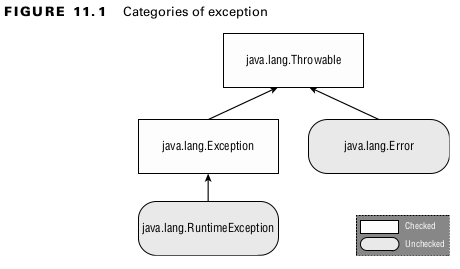
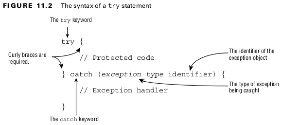
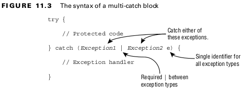
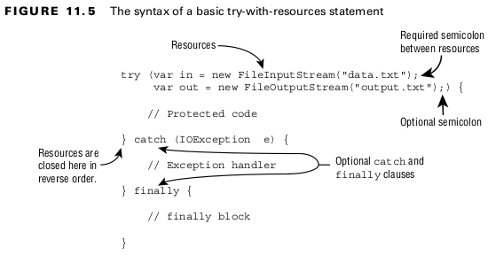
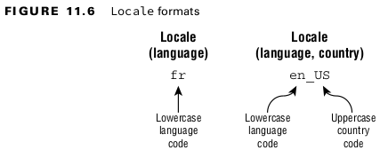

### Understanding Exceptions
A program can fail for just about any reason. Here are just a few possibilities:
- The code tries to connect to a website, but the Internet connection is down.
- You made a coding mistake and tried to access an invalid index in an array.
- One method calls another with a value that the method doesn’t support.
<br>

### Understanding Exception Types

<br>

#### Checked Exceptions
- A ***checked exception*** is an exception that must be declared or handled by the application  code where it is thrown. In Java, checked exceptions all inherit Exception but not RuntimeException.
- The throw keyword tells Java that you want to throw an Exception.
- throws keyword simply declares that the method might throw an Exception.
<br>

#### Unchecked Exceptions
- An ***unchecked exception*** is any exception that does not need to be declared or handled

#### Error and Throwable
- You can handle Throwable.
- Error exceptions, it is not recommended you do so in your application code.
<br>

#### Reviewing Exception Types
#### Table 11.1 Types of exceptions and errors
| Type                | How to recognize                                           | Okay for program to catch? | Is program required to handle or declare? |
|---------------------|------------------------------------------------------------|----------------------------|-------------------------------------------|
| Unchecked exception | Subclass of RuntimeException                               | Yes                        | No                                        |
| Checked exception   | Subclass of Exception but not subclass of RuntimeException | Yes                        | Yes                                       |
| Error               | Subclass of Error                                          | No                         | No                                        |
<br>

## Recognizing Exception Classes
### RuntimeException Classes
#### Table: 11.2 Unchecked exceptions
| Unchecked exception            | Description                                                                                                                                     |
|--------------------------------|-------------------------------------------------------------------------------------------------------------------------------------------------|
| ArithmeticException            | Thrown when code attempts to divide by zero.                                                                                                    |
| ArrayIndexOutOfBoundsException | Thrown when code uses illegal index to access array.                                                                                            |
| ClassCastException             | Thrown when attempt is made to cast object to class of which it is not an instance.                                                             |
| NullPointerException           | Thrown when there is a null reference where an object is required.                                                                              |
| IllegalArgumentException       | Thrown by programmer to indicate that method has been passed illegal or inappropriate argument.                                                 |
| NumberFormatException          | Subclass of IllegalArgumentException . Thrown when attempt is made to convert String to numeric type but String doesn’t have appropriate format |
<br>

### Checked Exception Classes
#### Table: 11.2 Checked exceptions
| Checked exception        | Description                                                                                                           |
|--------------------------|-----------------------------------------------------------------------------------------------------------------------|
| FileNotFoundException    | Subclass of IOException . Thrown programmatically when code tries to reference file that does not exist.              |
| IOException              | Thrown programmatically when problem reading or writing file.                                                         |
| NotSerializableException | Subclass of IOException . Thrown programmatically when attempting to serialize or deserialize non-serializable class. |
| ParseException           | Indicates problem parsing input.                                                                                      |
| SQLException             | Thrown when error related to accessing database.                                                                      |
<br>

### Error Classes
#### Table: 11.4 Errors
| Checked exception           | Description                                                                                                                  |
|-----------------------------|------------------------------------------------------------------------------------------------------------------------------|
| ExceptionInInitializerError | Thrown when static initializer throws exception and doesn’t handle it                                                        |
| StackOverflowError          | Thrown when method calls itself too many times (called infinite recursion because method typically calls itself without end) |
| NoClassDefFoundError        | Thrown when class that code uses is available at compile time but not runtime                                                |
<br>

### Handling Exceptions
#### Using try and catch Statements

<br>

#### Chaining catch Blocks
```
public void visitMonkeys() {
    try {
        seeAnimal();
    } catch (ExhibitClosedForLunch e) { // Subclass exception
        System.out.print("try back later");
    } catch (ExhibitClosed e) { // Superclass exception
        System.out.print("not today");
    }
}
```
<br>

#### Applying a Multi-catch Block
- A multi-catch block allows multiple exception types to be caught by the same catch block.
```
public static void main(String[] args) {
    try {
        System.out.println(Integer.parseInt(args[1]));
    } catch (ArrayIndexOutOfBoundsException | NumberFormatException e) {
        System.out.println("Missing or invalid input");
    }
}
```
<br>


<br>

```
catch(Exception1 e | Exception2 e | Exception3 e) // DOES NOT COMPILE
catch(Exception1 e1 | Exception2 e2 | Exception3 e3) // DOES NOT COMPILE
catch(Exception1 | Exception2 | Exception3 e) // OK
``` 
<br>

```
try {
    throw new IOException();
} catch (FileNotFoundException | IOException p) {} // DOES NOT COMPILE
```
- Since FileNotFoundException is a subclass of IOException.
<br>

#### Adding a finally Block
- If an exception is thrown, the finally block is run after the catch block. If no exception is thrown, the finally block is run after the try block completes.

<br>

#### System.exit()
```
try {
    System.exit(0);
} finally {
    System.out.print("Never going to get here"); // Not printed
}
```
- System.exit() tells Java, “Stop. End the program right now. Do not pass Go. Do not collect $200.” When System.exit() is called in the try or catch block, the finally block does not run.
<br>

## Automating Resource Management

#### Introducing try-with-Resources
```
public void readFile(String file) {
    try (FileInputStream is = new FileInputStream("myfile.txt")) {
        // Read file data
    } catch (IOException e) {
        e.printStackTrace();
    }
}
```
- We refer to this “hidden” finally block as an implicit finally block since it is created and used by the compiler automatically.
<br>

#### Basics of Try-with-Resources
- When multiple resources are opened, they are closed in the reverse of the order in which they were created.

<br>

#### Constructing Try-with-Resources Statements
- Only classes that implement the AutoCloseable interface can be used in a try-with-resources statement.
<br>

#### Declaring Resources
- While try-with-resources does support declaring multiple variables.
<br>

#### Applying Effectively Final
```
public static void main(String... xyz) {
    final var bookReader = new MyFileClass(4);
    MyFileClass movieReader = new MyFileClass(5);
    try (bookReader; var tvReader = new MyFileClass(6); movieReader) {
        System.out.println("Try Block");
    } finally {
        System.out.println("Finally Block");
    }
}
```
<br>

## Understanding Suppressed Exceptions
```
public class JammedTurkeyCage implements AutoCloseable {
    public void close() throws IllegalStateException {
        throw new IllegalStateException("Cage door does not close");
    }
    public static void main(String[] args) {
        try (JammedTurkeyCage t = new JammedTurkeyCage()) {
            System.out.println("Put turkeys in");
        } catch (IllegalStateException e) {
            System.out.println("Caught: " + e.getMessage());
        }
    }
}
```
<br>

```
public static void main(String[] args) {
    try (JammedTurkeyCage t = new JammedTurkeyCage()) {
        throw new IllegalStateException("Turkeys ran off");
    } catch (IllegalStateException e) {
        System.out.println("Caught: " + e.getMessage());
        for (Throwable t: e.getSuppressed())
            System.out.println("Suppressed: "+t.getMessage());
    }
}
```
<br>

- Line 7 throws the primary exception. At this point, the try clause ends, and Java automatically calls the close() method. 
- Line 3 of JammedTurkeyCage throws an IllegalStateException, which is added as a suppressed exception. 
- Then line 8 catches the primary exception. 
- Line 9 prints the message for the primary exception. 
- Lines 10 and 11 iterate through any suppressed exceptions and print them.
<br>

```
Caught: Turkeys ran off
Suppressed: Cage door does not close
```
<br>

- Keep in mind that suppressed exceptions apply only to exceptions thrown in the try clause.
## Formatting Values
#### Formatting Numbers
```
public final String format(double number)
public final String format(long number)
public DecimalFormat(String pattern)
```

#### Table: 11.5 DecimalFormat symbols
| Symbol | Meaning                                     | Examples |
|--------|---------------------------------------------|----------|
| #      | Omit position if no digit exists for it.    | $2.2     |                                     
| 0      | Put 0 in position if no digit exists for it | $002.20  |
<br>

#### Formatting Dates and Times
```
LocalDate date = LocalDate.of(2022, Month.OCTOBER, 20);
LocalTime time = LocalTime.of(11, 12, 34);
LocalDateTime dt = LocalDateTime.of(date, time);

System.out.println(date.format(DateTimeFormatter.ISO_LOCAL_DATE)); //2022-10-20
System.out.println(time.format(DateTimeFormatter.ISO_LOCAL_TIME)); //11:12:34
System.out.println(dt.format(DateTimeFormatter.ISO_LOCAL_DATE_TIME)); //2022-10-20T11:12:34
```
<br>

#### Customizing the Date/Time Format
#### Learning the Standard Date/Time Symbols
#### Table: 11. 6 Common date/time symbols
| Symbol | Meaning          | Examples                   | 
|--------|------------------|----------------------------|
| y      | Year             | 22,2022                    |  
| M      | Month            | 1,01,Jan,January           |
| d      | Day              | 5,05                       |  
| h      | Hour             | 9,09                       |
| m      | Minute           | 45                         |  
| S      | Second           | 52                         |
| a      | a.m./p.m.        | AM,PM                      |  
| z      | Time zone name   | Eastern Standard Time, EST |
| Z      | Time zone offset | -0400                      |     
<br>

#### Table: 11.7 Supported date/time symbols
| Symbol | LocalDate | LocalTime | LocalDateTime | ZonedDateTime |
|--------|-----------|-----------|---------------|---------------|
| y      | &check;   | &cross;   | &check;       | &check;       |
| M      | &check;   | &cross;   | &check;       | &check;       |
| d      | &check;   | &cross;   | &check;       | &check;       |
| h      | &cross;   | &check;   | &check;       | &check;       |
| m      | &cross;   | &check;   | &check;       | &check;       |
| S      | &cross;   | &check;   | &check;       | &check;       |
| a      | &cross;   | &check;   | &check;       | &check;       |
| z      | &cross;   | &cross;   | &cross;       | &check;       |
| Z      | &cross;   | &cross;   | &cross;       | &check;       |   
<br>

#### Adding Custom Text Values

## Supporting Internationalization and Localization

#### Picking a Locale
```
Locale locale = Locale.getDefault();
System.out.println(locale); // en_US
```
<br>

```
System.out.println(Locale.GERMAN); // de
System.out.println(Locale.GERMANY); // de_DE
```
<br>

- The first example selects the German language, which is spoken in many countries, including Austria ( de_AT ) and Liechtenstein ( de_LI ). 
- The second example selects both German the language and Germany the country.
<br>


<br>

#### Localizing Numbers
#### Table: 11.8 Factory methods to get a NumberFormat
| Description                             | Using default Locale and a specified Locale                                                                                      | 
|-----------------------------------------|----------------------------------------------------------------------------------------------------------------------------------|
| General-purpose formatter               | NumberFormat.getInstance() <br>NumberFormat.getInstance(Locale locale)                                                           |
| Same as getInstance                     | NumberFormat.getNumberInstance() <br>NumberFormat.getNumberInstance(Locale locale)                                               | 
| For formatting monetary amounts         | NumberFormat.getCurrencyInstance() <br>NumberFormat.getCurrencyInstance(Locale locale)                                           |
| For formatting percentages              | NumberFormat.getPercentInstance() <br>NumberFormat.getPercentInstance(Locale locale)                                             | 
| Rounds decimal values before displaying | NumberFormat.getIntegerInstance() <br>NumberFormat.getIntegerInstance(Locale locale)                                             | 
| Returns compact number formatter        | NumberFormat.getCompactNumberInstance() <br>NumberFormat.getCompactNumberInstance(Locale locale, NumberFormat.Style formatStyle) | 
<br>

### Localizing Dates
#### Table: 11.9 Factory methods to get a DateTimeFormatter
| Description                    | Using default Locale                                                                                                                                     | 
|--------------------------------|----------------------------------------------------------------------------------------------------------------------------------------------------------|
| For formatting dates           | DateTimeFormatter.ofLocalizedDate(FormatStyle dateStyle)                                                                                                 |
| For formatting times           | DateTimeFormatter.ofLocalizedTime(FormatStyle timeStyle)                                                                                                 | 
| For formatting dates and times | DateTimeFormatter.ofLocalizedDateTime(FormatStyle dateStyle, FormatStyle timeStyle) <br>DateTimeFormatter.ofLocalizedDateTime(FormatStyle dateTimeStyle) |
<br>

#### Specifying a Locale Category
#### Table: 11.10 Locale.Category values
| Description | Description                                                | 
|-------------|------------------------------------------------------------|
| DISPLAY     | Category used for displaying data about locale             |
| FORMAT      | Category used for formatting dates, numbers, or currencies | 
<br>

#### Loading Properties with Resource Bundles

#### Picking a Resource Bundle
#### Table: 11.10 Locale.Category values
| Step | Looks for file                                     | Reason                                    |
|------|----------------------------------------------------|-------------------------------------------|
| 1    | Zoo_fr_FR.properties                               | Requested locale                          |
| 2    | Zoo_fr.properties                                  | Language we requested with no country     |
| 3    | Zoo_en_US.properties                               | Default locale                            |
| 4    | Zoo_en.properties                                  | Default locale’s language with no country |
| 5    | Zoo.properties                                     | No locale at all—default bundle           |
| 6    | If still not found, throw MissingResourceException | No locale or default bundle available     |
<br>

- As another way of remembering the order of Table 11.11, learn these steps:
1. Look for the resource bundle for the requested locale, followed by the one for the default locale.
2. For each locale, check the language/country, followed by just the language.
3. Use the default resource bundle if no matching locale can be found.
<br>

#### Selecting Resource Bundle Values
#### Table: 11.12 Selecting resource bundle properties
| Description | Description                                                   | 
|-------------|---------------------------------------------------------------|
| Zoo_fr_FR   | Zoo_fr_FR.properties <br>Zoo_fr.properties <br>Zoo.properties | 
<br>

## Formatting Messages

#### Using the Properties Class