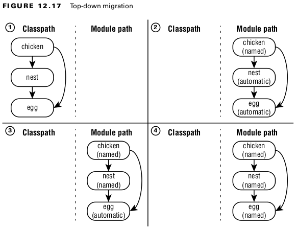

## Creating Module:
- The ***module-info*** file must be in the root directory of your module. Regular Java classes should be in packages.
- The ***module-info*** file must use the keyword ***module*** instead of ***class***, ***interface***, or ***enum***.
- The module name follows the naming rules for package names. It often includes periods ( . ) in its name. Regular class and package names are not allowed to have dashes ( - ). Module names follow the same rule.
<br>

## Compiling Module

```
javac --module-path mods 
      -d feeding 
      feeding/zoo/animal/feeding/*.java feeding/module-info.java
```
- ***module-path*** this option indicates the location any custom module files.
- ***-d*** option specifies the directory to place the class files in.
<br>

#### TABLE 12.1 Options you need to know for using modules with javac
| Use for                   | Abbreviation    | Long form                  | 
|---------------------------|-----------------|----------------------------|
| Directory for class files | -d &lt;dir&gt;  | n/a                        |
| Module path               | -p &lt;path&gt; | --module-path &lt;path&gt; |
<br>

## Running Module

```
java --module-path feeding 
     --module zoo.animal.feeding/zoo.animal.feeding.Task.java
```
<br>

#### TABLE 12.2 Options you need to know for using modules with java
| Use for     | Abbreviation    | Long form                  |
|-------------|-----------------|----------------------------|
| Module name | -m &lt;name&gt; | --module &lt;name&gt;      |
| Module path | -p &lt;path&gt; | --module-path &lt;path&gt; |
<br>

## packing Module

```
jar -cvf mods/zoo.animal.feeding.jar 
    -C feeding/ .
```
<br>

#### TABLE 12.2.1
| Use for                                                  | Abbreviation   | Long form         |
|----------------------------------------------------------|----------------|-------------------|
| Create a new JAR file                                    | -c             | --create          |
| Prints details when working with JAR files.              | -v             | --verbose         |
| JAR filename                                             | -f (fileName)  | --file (fileName) |
| Directory containing files to be used to create the JAR. | -C (directory) |                   |
<br>

## Directives

#### Exports

- Directive is used to indicate that a ***module*** intends ***for*** those packages to be used by Java code outside the ***module***.

```
module zoo.animal.feeding {
    exports zoo.animal.feeding;
}
```
<br>

##### Exporting a Package

- ***exports*** packageName ***exports*** a ***package*** to other modules.

```
module zoo.animal.talks {
    exports zoo.animal.talks.content to zoo.staff;
    exports zoo.animal.talks.media;
    exports zoo.animal.talks.schedule;
}
```
<br>

##### TABLE 11.3 Access control with modules
| Level                     | Within module code                             | Outside module                                       |
|---------------------------|------------------------------------------------|------------------------------------------------------|
| private                   | Available only within class                    | No access                                            |
| default (package-private) | Available only within package                  | No access                                            |
| protected                 | Available only within package or to subclasses | Accessible to subclasses only if package is exported |
| public                    | Available to all classes                       | Accessible only if package is exported               |
<br>

#### Requiring

- ***requires*** moduleName specifies that the current ***module***
depends on moduleName.

```
module zoo.animal.care {
    requires zoo.animal.talks;
}
```
<br>

#### Requiring a Module Transitively

```
module zoo.animal.care {
    requires transitive zoo.animal.feeding;
}
```
<br>

#### Open - Opening a Package

- Java allows callers to inspect and call code at runtime with a technique called reflection.
- The opens directive is used to enable reflection of a package within a module.

```
module zoo.animal.talks {
    opens zoo.animal.talks.schedule;
    opens zoo.animal.talks.media to zoo.staff;
}
```

- The first example allows any module using this one to use reflection.
- The second example only gives that privilege to the zoo.staff module.
<br>

#### Opening an Entire Module

- open all packages for reflection, open module modifier.

```
open module zoo.animal.talks { 
}
```
<br>

## Creating a Service
- A service is composed of an interface.
- The implementations are not part of the service.
<br>

#### provides

#### Declaring the Service Provider Interface
- This interface is called the service provider interface because it specifies what behavior our service will have.
- A service provider “interface” can be an abstract class rather than an actual interface.
<br>

#### Creating a Service Locator
- A service locator can find any classes that implement a service provider interface. 

```
// TourFinder.java
package zoo.tours.reservations;
import java.util.*;
import zoo.tours.api.*;
public class TourFinder {

    public static Tour findSingleTour() {
        ServiceLoader<Tour> loader = ServiceLoader.load(Tour.class);
        for (Tour tour : loader)
            return tour;
        return null;
    }

    public static List<Tour> findAllTours() {
        List<Tour> tours = new ArrayList<>();
        ServiceLoader<Tour> loader = ServiceLoader.load(Tour.class);
        for (Tour tour : loader)
            tours.add(tour);
        return tours;
    }
}
```
<br>

```
// module-info.java
module zoo.tours.reservations {
    exports zoo.tours.reservations;
    requires zoo.tours.api;
    uses zoo.tours.api.Tour;
}
```
<br>

#### uses

#### Invoking from a Consumer
- A consumer (or client) refers to a module that obtains and uses a service
<br>

## Adding a Service Provider
- A service provider is the implementation of a service provider interface.
```
// module-info.java
module zoo.tours.agency {
    requires zoo.tours.api;
    provides zoo.tours.api.Tour with zoo.tours.agency.TourImpl;
}
```
<br>

- The module declaration requires the module containing the interface as a dependency.
- We use the provides directive. This allows us to specify that we provide an implementation of the interface with a specific implementation class.

```
provides interfaceName with className;
```
<br>

## Reviewing Directives and Services
#### TABLE 12.4 Reviewing services
| Artifact                   | Part of the service | Directives required           |
|----------------------------|---------------------|-------------------------------|
| Service provider interface | Yes                 | exports                       |
| Service provider           | No                  | exports <br>provides          |
| Service locator            | Yes                 | exports <br>requires <br>uses |
| Consumer                   | No                  | requires                      |
<br>

#### TABLE 12.5 Reviewing directives
| Directive                                          | Description                               |
|----------------------------------------------------|-------------------------------------------|
| exports package; </br> exports package to module;  | Makes package available outside module    |
| required module; </br> requires transitive module; | Specifies another module as dependency    |
| opens package; </br> opens package to module;      | Allows package to be used with reflection |
| provides serviceInterface with implName;           | Makes service available                   |
| uses serviceInterface;                             | References services                       |
<br>

## Identifying Built-in Modules
#### TABLE 12.6 Common modules
| Module name  | What it contains                                | Coverage in book               |
|--------------|-------------------------------------------------|--------------------------------|
| java.base    | Collections, math, IO, NIO.2, concurrency, etc. | Most of this book              |
| java.desktop | Abstract Windows Toolkit(AWT) and Swing         | Not on exam beyond module name |
| java.logging | Logging                                         | not on exam beyond module name |
| java.sql     | JDBC                                            | Chapter 15, "JDBC"             |
| java.xml     | Extensible Markup Language(XML)                 | Not on exam beyond module name |
<br>

## Describing a Module
<br>

#### Options for javac
#### TABLE 12.11 Options you need to know for the exam: javac
| Option                                                                                     | Description                                     | 
|--------------------------------------------------------------------------------------------|-------------------------------------------------|
| -cp &lt;classpath&gt; <br>-classpath &lt;classpath&gt; <br> --class-path &lt;classpath&gt; | Location of JARs in nonmodular program          |
| -d &lt;dir&gt;                                                                             | Directory in wich to place generated class file |
| -p &lt;path&gt; <br>--module-path &lt;path&gt;                                             | Location of JARs in modular program             |
<br>

#### Options for java
#### TABLE 12.12 Options you need to know for the exam: java
| Option                                         | Description                                     | 
|------------------------------------------------|-------------------------------------------------|
| -p &lt;path&gt; <br>--module-path &lt;path&gt; | Location of JARs in modular program             |
| -m &lt;name&gt; <br>--module-path &lt;name&gt; | Module name to run                              |
| -d &lt;dir&gt;  <br>--describe-module          | Describe details of module                      |
| --list-modules                                 | List observable modules without running program |
| --show-module-resolution                       | Show modules when running program               |
<br>

#### Options for jar
#### TABLE 12.13 Options you need to know for the exam: jar
| Option                             | Description                                         | 
|------------------------------------|-----------------------------------------------------|
| -c &lt;classpath&gt; <br> --create | Creates new JAR file                                |
| -v <br>--verbose                   | Prints details when working with JAR files          |
| -f <br>--file                      | JAR filename                                        |
| -C                                 | Directory containing files to be used to create JAR |
| -d <br>--describe-module           | Describe details of module                          |
<br>

#### Options for jdeps
#### TABLE 12.14 Options you need to know for the exam: jdeps
| Option                            | Description                         | 
|-----------------------------------|-------------------------------------|
| --module-path &lt;path&gt;        | Location of JARs in modular program |
| -s <br>-summary                   | Summarizes output                   |
| --jdk-internals <br>-jdkinternals | Lists uses of internal APIs         |
<br>

#### Options for jlink
#### TABLE 12.15 Options you need to know for the exam: jlink
| Option                                          | Description                         | 
|-------------------------------------------------|-------------------------------------|
| -p &lt;path&gt; <br> --module-path &lt;path&gt; | Location of JARs in modular program |
| --add-modules                                   | List of module to package           |
| --output                                        | Name of output directory            |
<br>

## Classpath vs. Modulepath
#### Classpath in Java
- Classpath is an environment variable that tells the Java Virtual Machine (JVM) where to find classes and resources during runtime.
<br>

```
javac -cp "lib/mylibrary.jar" MyProgram.java 
java -cp "lib/mylibrary.jar:." MyProgram
```
<br>

#### Modulepath in Java
- It is a collection of directories, JAR files, and modules that contain compiled module files (.mod files) and their associated dependencies.
<br>

```
javac --module-source-path project -d mods --module moduleA --module moduleB 
java --module-path mods --module moduleB/com.example.ModuleB
```
<br>

#### Differences Between Modulepath and Classpath
| Classpath                                                                          | Modulepath                                                                                             | 
|------------------------------------------------------------------------------------|--------------------------------------------------------------------------------------------------------|
| Handles dependencies at a granular level using class files and JAR files           | Enforces explicit dependency declarations at the module level                                          |
| Doesn’t enforce explicit dependency declarations, leading to potential issues      | Ensures a clear understanding of required resources, avoiding conflicts                                |
| All classes and resources are globally accessible by default                       | Promotes encapsulation and controlled visibility                                                       |
| Unrestricted accessibility can lead to naming conflicts or unintended dependencies | Prevents unwanted dependencies. Since the only exported packages are accessible by other modules       |
| Less efficient since it requires searching through directories and JAR files       | More efficient by building a dependency graph and loading only required modules, improving performance |
| The search process can be time-consuming, especially for large classpaths          | Reduces search overhead, enhancing runtime performance                                                 |
<br>

### Rules for determining the name of an automatic modules:
- If the MANIFEST.MF specifies an Automatic-Module-Name, use that. Otherwise, proceed with the remaining rules.
- Remove the file extension from the JAR name.
- Remove any version information from the end of the name. A version is digits and dots with possible extra information at the end: for example,-1.0.0 or -1.0-RC .
- Replace any remaining characters other than letters and numbers with dots.
- Replace any sequences of dots with a single dot.
- Remove the dot if it is the first or last character of the result.
<br>

## Comparing Types of Modules

#### Named Modules
- In one containing a module-info.java
- It appears in the root of the JAR alongside or ore package.
<br>

#### Automatic Modules
- An ***automatic module*** appears on the module path but does not contain a module-info.java file.
- Java automatically determines the module name.
- It automatically exports all packages.
<br>

#### Unnamed Modules
- An ***unnamed module*** appears on the classpath.
- An ***unnamed module*** does not usually contain a module-info.java file. If it happens to contain one, that file will be ignored since it is on the classpath. 
- ***Unnamed modules*** do not export any packages to named or automatic modules.
<br>

## Command Line Options
- ***module-path***: We use the –module-path option to specify the module path. This is a list of one or more directories that contain your modules.
- ***add-reads***: Instead of relying on the module declaration file, we can use the command line equivalent of the requires directive; –add-reads.
- ***add-exports***: Command line replacement for the exports directive.
- ***add-opens***: Replace the open clause in the module declaration file.
- ***add-modules***: Adds the list of modules into the default set of modules
- ***list-modules***: Prints a list of all modules and their version strings
- ***patch-module***: Add or override classes in a modules
- ***illegal-access=permit|warn|deny***: Either relax strong encapsulation by showing a single global warning, shows every warning, or fails with errors. The default is permit.
<br>

## Migrating an Application
<br>

#### Bottom-Up Migration Strategy

This approach works best when you have the power to convert any JAR files that aren’t already modules. For a bottom-up migration, you follow these steps:

1. Pick the lowest-level project that has not yet been migrated. (Remember the way we ordered them by dependencies in the previous section?)
2. Add a module-info.java file to that project. Be sure to add any exports to expose any package used by higher-level JAR files. Also, add a requires directive for any modules this module depends on.
3. Move this newly migrated named module from the classpath to the module path.
4. Ensure that any projects that have not yet been migrated stay as unnamed modules on the classpath.
5. Repeat with the next-lowest-level project until you are done.


<br>

#### Top-Down Migration Strategy

A top-down migration strategy is most useful when you don’t have control of every JAR file used by your application. For a top-down migration, you follow these steps:

1. Place all projects on the module path.
2. Pick the highest-level project that has not yet been migrated.
3. Add a module-info.java file to that project to convert the automatic module into a named module. Again, remember to add any exports or requires directives. You can use the automatic module name of other modules when writing the requires directive since most of the projects on the module path do not have names yet.
4. Repeat with the next-highest-level project until you are done.

