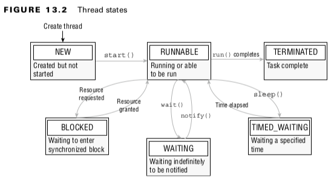
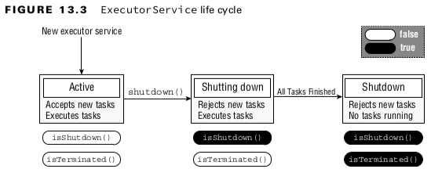

# Introducing Threads

A single-threaded process is one that contains exactly one thread, whereas a multi-threaded process supports more than one thread.
<br>
## Managing a Thread’s Life Cycle

<br>

### Polling with Sleep
- Polling is the process of intermittently checking data at some fixed interval.
<br>

### Thread interrupt
- interrupt() only impacts a thread in a WAITING or TIMED_WAITING state.
  Calling interrupt() on a thread in a NEW or RUNNABLE state has no impact. mInterrupting a thread that is not alive not have any effect.
- Creating Threads with the Concurrency API
- Introducing the Single-Thread Executor
- Single-thread executor, tasks are guaranteed to be executed sequentially.

### Shutting Down a Thread Executor

<br>

## Submitting Tasks
### TABLE 13.1 ExecutorService methods
| Method name                                                                                              | Description                                                                                                                                       |
|----------------------------------------------------------------------------------------------------------|---------------------------------------------------------------------------------------------------------------------------------------------------|
| void execute(Runnable command)                                                                           | Executes a *Runnable* task at some point in the future                                                                                            |
| Future<?> submit(Runnable task)                                                                          | Executes a *Runnable* task at some point in the future and returns a *Future* representing the task                                               |
| <T> Future<T> submit(Callable<T> task)                                                                   | Executes a *Callable* task at some point in the future and returns a *Future* representing the pending results of the task                        |
| <T> List<Future<T>> invokeAll(Collection<? extends Callable<T>> tasks) throws InterruptedException       | Executes the given tasks and waits for all tasks to complete. Returns a *List* of *Future* instances, in the same order th                        |
| <T> T invokeAny(Collection<? extends Callable<T>> tasks) throws InterruptedException, ExecutionException | Executes the given tasks and waits for at least one to complete. Returns a *Future* instance for a complete task and cancels any unfinished tasks |
<br>

### TABLE 13.2 Future methods
| Method name                                   | Description                                                                                                                                                                       |
|-----------------------------------------------|-----------------------------------------------------------------------------------------------------------------------------------------------------------------------------------|
| boolean isDone()                              | Returns *true* if the task was completed, threw an exception, or was cancelled                                                                                                    |
| boolean isCancelled()                         | Returns *true* if the task was cancelled before it completed normally                                                                                                             | 
| boolean cancel(boolean mayInterruptIfRunning) | Attempts to cancel execution of the task and returns *true* if it was successfully cancelled or *false* if it could not be cancelled or is complete                               |
| V get()                                       | Retrieves the result of a task, waiting endlessly if it is not yet available                                                                                                      | 
| V get(long timeout, TimeUnit unit)            | Retrieves the result of a task, waiting the specified amount of time. If the result is not ready by the time the timeout is reached, a checked *TimeoutException* will be thrown. |
<br>

### TABLE 13.3 TimeUnit values
| Enum name             | Description                                         |
|-----------------------|-----------------------------------------------------|
| TimeUnit.NANOSECONDS  | Time in one‐billionth of a second (1/1,000,000,000) |
| TimeUnit.MICROSECONDS | Time in one‐millionth of a second (1/1,000,000)     |
| TimeUnit.MILLISECONDS | Time in one‐thousandth of a second (1/1,000)        |
| TimeUnit.SECONDS      | Time in seconds                                     |
| TimeUnit.MINUTES      | Time in minutes                                     | 
| TimeUnit.HOURS        | Time in hours                                       | 
| TimeUnit.DAYS         | Time in days                                        |
<br>

### Introducing Callable

- The java.util.concurrent.Callable functional interface
- call() method returns a value and can throw a checked exception. The following is the definition of the Callable interface:

```
@FunctionalInterface public interface Callable<V> {
    V call() throws Exception;
}
```

### Scheduling Tasks

- ScheduledExecutorService, which is a subinterface of ExecutorService, can be used
  for just such a task.
<br>

### TABLE 13.4 ScheduledExecutorService methods
| Method Name                                                                            | Description                                                                                                                                                                          |
|----------------------------------------------------------------------------------------|--------------------------------------------------------------------------------------------------------------------------------------------------------------------------------------|
| schedule(Callable<V> callable, long delay, TimeUnit unit)                              | Creates and executes a *Callable* task after the given delay                                                                                                                         | 
| schedule(Runnable command, long delay, TimeUnit unit)                                  | Creates and executes a *Runnable* task after the given delay                                                                                                                         | 
| scheduleAtFixedRate(Runnable command, long initialDelay, long period, TimeUnit unit)   | Creates and executes a *Runnable* task after the given initial delay, creating a new task every period value that passes                                                             | 
| scheduleWithFixedDelay(Runnable command, long initialDelay, long delay, TimeUnit unit) | Creates and executes a *Runnable* task after the given initial delay and subsequently with the given delay between the termination of one execution and the commencement of the next |
<br>

### Increasing Concurrency with Pools
### TABLE 13.5 Executors factory methods
| Method                                                      | Description                                                                                                                                                                        |
|-------------------------------------------------------------|------------------------------------------------------------------------------------------------------------------------------------------------------------------------------------|
| ExecutorService newSingleThreadExecutor()                   | Creates a single‐threaded executor that uses a single worker thread operating off an unbounded queue. Results are processed sequentially in the order in which they are submitted. |
| ScheduledExecutorService newSingleThreadScheduledExecutor() | Creates a single‐threaded executor that can schedule commands to run after a given delay or to execute periodically                                                                |
| ExecutorService newCachedThreadPool()                       | Creates a thread pool that creates new threads as needed but will reuse previously constructed threads when they are available                                                     |
| ExecutorService newFixedThreadPool(int)                     | Creates a thread pool that reuses a fixed number of threads operating off a shared unbounded queue                                                                                 |
| ScheduledExecutorService newScheduledThreadPool(int)        | Creates a thread pool that can schedule commands to run after a given delay or to execute periodically                                                                             |
<br>


## Writing Thread-Safe Code

### TABLE 13.6 Atomic classes
| Class Name    | Description                                    |
|---------------|------------------------------------------------|
| AtomicBoolean | A boolean value that may be updated atomically |
| AtomicInteger | An int value that may be updated atomically    |
| AtomicLong    | A long value that may be updated atomically    |
<br>

### TABLE 13.7 Common atomic methods
| Method name       | Description                                                                  |
|-------------------|------------------------------------------------------------------------------|
| get()             | Retrieves the current value                                                  |
| set()             | Sets the given value, equivalent to the assignment = operator                |
| getAndSet()       | Atomically sets the new value and returns the old value                      |
| incrementAndGet() | For numeric classes, atomic pre‐increment operation equivalent to *++value*  |
| getAndIncrement() | For numeric classes, atomic post‐increment operation equivalent to *value++* | 
| decrementAndGet() | For numeric classes, atomic pre‐decrement operation equivalent to *‐‐value*  |
| getAndDecrement() | For numeric classes, atomic post‐decrement operation equivalent to *value‐‐* |
<br>

### Synchronizing on Methods
```
void sing() {
    synchronized(this) {
        System.out.print("La la la!");
    }
}

synchronized void sing() {
    System.out.print("La la la!");
}

static synchronized void dance() {
    System.out.print("Time to dance!");
}
```
<br>

### Attempting to Acquire a Lock

### TABLE 13.8 Lock methods
| Method                         | Description                                                                                                                                         |
|--------------------------------|-----------------------------------------------------------------------------------------------------------------------------------------------------|
| void lock()                    | Requests a lock and blocks until lock is acquired                                                                                                   |
| void unlock()                  | Releases a lock                                                                                                                                     |
| boolean tryLock()              | Requests a lock and returns immediately. Returns a boolean indicating whether the lock was successfully acquired                                    |
| boolean tryLock(long,TimeUnit) | Requests a lock and blocks up to the specified time until lock is required. Returns a boolean indicating whether the lock was successfully acquired |
<br>

### Reviewing the Lock Framework

- Ability to request a lock without blocking.
- Ability to request a lock while blocking for a specified amount of time.
- A lock can be created with a fairness property, in which the lock is granted to threads in the order in which it was requested.
<br>

## Using Concurrent Collections
### TABLE 13.9 Concurrent collection classes
| Class name            | Java Collections Framework interfaces        | Elements ordered? | Sorted? | Blocking? |
|-----------------------|----------------------------------------------|-------------------|---------|-----------|
| ConcurrentHashMap     | ConcurrentMap                                | No                | No      | No        |
| ConcurrentLinkedQueue | Queue                                        | Yes               | No      | No        |
| ConcurrentSkipListMap | ConcurrentMap <br>SortedMap <br>NavigableMap | Yes               | Yes     | No        |
| ConcurrentSkipListSet | SortedSet <br>NavigableSet                   | Yes               | Yes     | No        |
| CopyOnWriteArrayList  | List                                         | No                | No      | No        |
| LinkedBlockingQueue   | BlockingQueue                                | Yes               | No      | Yes       |
<br>

### TABLE 13.10 BlockingQueue waiting methods
| Method  name                            | Description                                                                                                                                    |
|-----------------------------------------|------------------------------------------------------------------------------------------------------------------------------------------------|
| offer(E e, long timeout, TimeUnit unit) | Adds an item to the queue, waiting the specified time and returning *false* if the time elapses before space is available                      |
| poll(long timeout, TimeUnit unit)       | Retrieves and removes an item from the queue, waiting the specified time and returning *null* if the time elapses before the item is available |
<br>

### TABLE 13.10 Synchronized collections methods

synchronizedCollection(Collection<T> c)
synchronizedList(List<T> list)
synchronizedMap(Map<K,V> m)
synchronizedNavigableMap(NavigableMap<K,V> m)
synchronizedNavigableSet(NavigableSet<T> s)
synchronizedSet(Set<T> s)
synchronizedSortedMap(SortedMap<K,V> m)
synchronizedSortedSet(SortedSet<T> s)
<br>

### Identifying Threading Problems
- Threads in a CyclicBarrier will each wait for the barrier limit to be reached before continuing.
- Liveness is the ability of an application to be able to execute in a timely manner.
- liveness problems are often the result of a thread entering a BLOCKING or WAITING state forever
<br>

#### Deadlock
- Deadlock occurs when two or more threads are blocked forever, each waiting on the other.
<br>

#### Starvation
- Starvation occurs when a single thread is perpetually denied access to a shared resource
  or lock.
<br>

#### Livelock
- Livelock occurs when two or more threads are conceptually blocked forever.
- Livelock is a special case of resource starvation in which two or more threads actively try to acquire a set of locks, are unable to do so, and restart part of the process.

#### Processing Parallel Reductions
- A parallel reduction is a reduction operation applied to a parallel stream. The results for parallel reductions can differ from what you expect when working with serial streams.


### Performing Order-Based Tasks
```
System.out.print(List.of(1,2,3,4,5,6)
    .parallelStream()
    .findAny()
    .get());
```

### Combining Result with reduce()
```
<U> U reduce(U identity, BiFunction<U,? super T,U> accumulator, BinaryOperator<U> combiner);
```
<br>

```
System.out.print(List.of('w', 'o', 'l', 'f')
    .parallelStream()
    .reduce("",
        (s1,c) -> s1 + c,
        (s2,s3) -> s2 + s3)); // wolf
```

- While neither the serial nor the parallel stream is guaranteed to return the first value, the serial stream often does.

### Combining Results with collect()
```
<R> R collect(Supplier<R> supplier, BiConsumer<R, ? super T> accumulator, BiConsumer<R, R> combiner);
```
<br>

```
Stream<String> stream =  Stream.of("w", "o", "l", "f");
SortedSet<String> set = stream.collect(ConcurrentSkipListSet::new,
    Set::add,
    Set::addAll);
    
System.out.println(set); //[f, l, o, w];
```