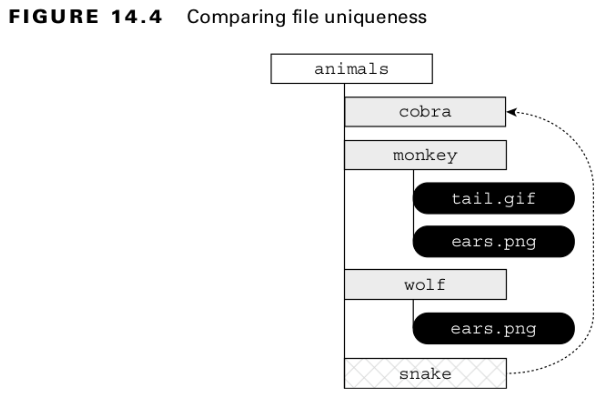
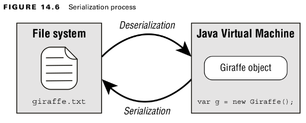
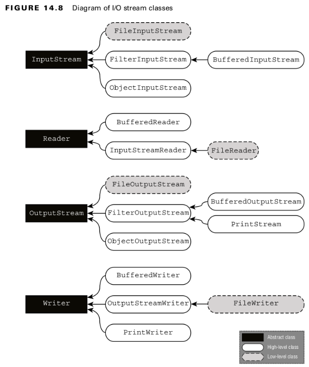

## Referencing Files and Directories
- A directory is a location that can contain files as well as other directories.
- The root directory is the topmost directory in the file system.
- A path is a representation of a file or directory within a file system.
- Unix-based systems use the forward slash, /.
- Windows-based systems use the back-slash, \.
- The **absolute path** of a file or directory is the full path from the root directory to the file or directory, including all subdirectories that contain the file or directory.
- The ***relative path** of a file or directory is the path from the current working directory to the file or directory.
<br>

- If a path starts with a forward slash (/), it is absolute, with / as the root directory, such as /bird/parrot.png.
- If a path starts with a drive letter (c:), it is absolute, with the drive letter as the root directory, such as C:/bird/info.
- Otherwise, it is a relative path, such as bird/parrot.png.
- A **path symbol** is one of a reserved series of characters with special meaning in some file systems.
<br>

#### Table: 14.1 File-system symbols
| Enum name | Description                                        |
|-----------|----------------------------------------------------|
| .         | A reference to the current directory               |
| ..        | A reference to the parent of the current directory |
<br>

- A symbolic link is a special file within a file system that serves as a reference or pointer to another file or directory.
<br>

#### Table: 14.2 Options for creating File and Path
| Create     | Declared in | Method or Constructor                                                                                                  |
|------------|-------------|------------------------------------------------------------------------------------------------------------------------|
| File       | File        | public File(String pathname) <br>public File(String parent, String child) <br>public File(String parent, String child) |
| File       | Path        | public default File toFile()                                                                                           |
| Path       | File        | public Path toPath()                                                                                                   |
| Path       | Path        | public static Path of(String first, String... more) <br>public static Path of(URI uri)                                 |
| Path       | Paths       | public static Path get(String first, String... more) <br>public static Path get(Uri uri)                               |
| Path       | FileSystem  | public Path getPath(String first, String... more)                                                                      |
| FileSystem | FileSystem  | public static FileSystem toDefault()                                                                                   |
<br>

## Operating on File and Path
#### Using shared Functionality
<br>

#### Table: 14.3 Common File and Path operations
| Description                                         | I/O file instance method | NIO.2 Path instance method |
|-----------------------------------------------------|--------------------------|----------------------------|
| Gets name of file/directory                         | getName()                | getFileName()              |
| Retrieves parent directory or null if there is none | getParent()              | getParent                  |
| Checks if file/directory is absolute path           | isAbsolute()             | isAbsolute()               |
<br>

#### Table: 14.4 Common File and Files operations
| Description                                                    | I/O file instance method | NIO.2 Path instance method                                       |
|----------------------------------------------------------------|--------------------------|------------------------------------------------------------------|
| Delete file/directory                                          | delete()                 | deleteIfExists(Path p) throws IOException                        |
| Checks if file/directory exists                                | exists()                 | exists(Path p, LinkOption... o)                                  |
| Retrieves absolute path of file/directory                      | getAbsolutePath()        | toAbsolutePath()                                                 |
| Checks if resource is directory                                | isDirectory()            | isDirectory(Path p, LinkOption... o)                             |
| Checks if resource is file                                     | isFile()                 | isRegularFile(PAth p, LinkOption... o)                           |
| Returns the time the file was last modified                    | lastModified()           | getLastModifiedTime(Path p, LinkOption... o) throws IOException  |
| Retrieves number obf bytes in file                             | length()                 | size(Path p) throws IOException                                  |
| Lists contents of directory                                    | listFiles()              | list(Path p) throws IOException                                  |
| Create directory                                               | mkdir()                  | createDirectory(Path p, FileAttribute... a) throws IOException   |
| Create directory including any non-existent parent directories | mkdirs()                 | createDirectories(Path p, FileAttribute... a) throws IOException |
| Renames file/directory denoted                                 | renameTo(File dest)      | move(Path src, Path dest, CopyOption... o) throws IOException    |
<br>


### Handling Methods That Declare IOException

Common causes of a method throwing this exception include the following:
- Loss of communication to the underlying file system.
- File or directory exists but cannot be accessed or modified.
- File exists but cannot be overwritten.
- File or directory is required but does not exist.

### Providing NIO.2 Optional Parameters


#### Table: 14.5 Common NIO.2 method arguments
| Enum type          | Interface Inherited        | Enum value                                                                      | Details                                                                                                                                                                                                                                                                                                           |
|--------------------|----------------------------|---------------------------------------------------------------------------------|-------------------------------------------------------------------------------------------------------------------------------------------------------------------------------------------------------------------------------------------------------------------------------------------------------------------|
| LinkOption         | CopyOption </br>OpenOption | NOFOLLOW_LINKS                                                                  | Do not follow symbolic links.                                                                                                                                                                                                                                                                                     |
| StandardCopyOption | CopyOption                 | ATOMIC_MOVE </br>COPY_ATTRIBUTS </br>REPLACE_EXISTING                           | Move file as atomic file system operation. </br>Copy existing attributes to new file. </br>Overwrite file if it already exists.                                                                                                                                                                                   |
| StandardOpenOption | OpenOption                 | APPEND </br>CREATE </br>CREATE_NEW  </br>READ </br>TRUNCATE_EXISTING </br>WRITE | If file is already open for write, then append to the end. </br>Create a new file if it does not exist. </br>Create a new file only if it does not exist, fail otherwise. </br>Open for read access. </br>If file is already open for write, then erase file and append to beginning. </br>Open for write access. |
| FileVisitOption    | N/A                        | FOLLOW_LINKS                                                                    | Follow symbolic links.                                                                                                                                                                                                                                                                                            |
<br>

#### Interacting with NIO.2 Paths
- Path instances are immutable.
<br>

#### Viewing the Path
- The **toString()** method returns a String representation of the entire path.
- The **getNameCount()** and **getName()** methods are often used together to retrieve the number of elements in the path and a reference to each element, respectively. These two methods do not include the root directory as part of the path. These two methods do not include the root directory as part of the path.
<br>

#### Creating Part of the Path
- The **subpath()** method to select portions of a path. It takes two parameters: an **inclusive beginIndex** and an **exclusive endIndex**.
- Like **getNameCount()** and **getName()**, **subpath()** is zero-indexed and does not include the root. Also like **getName()**, **subpath()** throws an exception if invalid indices
  are provided.
<br>

#### Accessing Path Elements
- The **getFileName()** method returns the Path element of the current file or directory.
- **getParent()** returns the full path of the containing directory. The **getParent()** method returns null if operated on the root path or at the top of a relative path.
- The **getRoot()** method returns the root element of the file within the file system, or null if the path is a relative path.
<br>

#### Resolving Paths
- The **resolve()** method concatenate paths
```
Path path1 = Path.of("/cats/../panther");
Path path2 = Path.of("food");

System.out.println(path1.resolve(path2));
```
<br>

- The code snippet generates the following output: 
```
/cats/../panther/food
```
<br>
- resolve() does not clean up path symbols.
- If an absolute path is provided as input to the method, that is the value returned.
<br>

#### Relativizing a Path
- The **relativize()** method for constructing the relative path from one Path to another
```
var path1 = Path.of("fish.txt");
var path2 = Path.of("friendly/birds.txt");

System.out.println(path1.relativize(path2));
System.out.println(path2.relativize(path1));
```
<br>

- The examples print the following:
```
../friendly/birds.txt
../../fish.txt
```
<br>

- If both path values are relative, the relativize() method computes the paths as if they are in the same current working directory. Alternatively, if both path values are absolute, the method computes the relative path from one absolute location to another
```
Path path3 = Paths.get("E:\\habitat");
Path path4 = Paths.get("E:\\sanctuary\\raven\\poe.txt");
System.out.println(path3.relativize(path4));
System.out.println(path4.relativize(path3));
```
<br>

This code snippet produces the following output:
```
..\sanctuary\raven\poe.txt
..\..\..\habitat
```
<br>

- The relativize() method requires both paths to be absolute or relative and throws an exception if the types are mixed.
- On Windows-based systems, it also requires that if absolute paths are used, both paths must have the same root directory or drive letter.
<br>

#### Normalizing a Path
- The **normalize()** method to eliminate unnecessary redundancies in a path.
```
var p1 = Path.of("./armadillo/../shells.txt"); // shells.txt
var p2 = Path.of("/cats/../panther/food"); // /panther/food
var p3 = Path.of("../../fish.txt"); // ../../fish.txt
```
<br>

- The path symbol .. refers to the parent directory.
- The path symbol . refers to the current directory.
- The normalize() method does not remove all of the path symbols, only the ones that can be reduced.
<br>

#### Retrieving the Real File System Path
- **toRealPath()** you want to verify that the path exists within the file system.
- It eliminates any redundant path symbols.
- It will join the path with the current working directory if the path is relative.
- **toRealPath()** will throw an exception if the path does not exist.
<br>

#### Table: 14.6 Path APIs
| Description                                       | Method or Constructor                                         |
|---------------------------------------------------|---------------------------------------------------------------|
| File path as String                               | public String toString()                                      |
| Single segment                                    | public Path getName(int index)                                |
| Number of segments                                | public int getNameCount()                                     |
| Segments in range                                 | public Path subPath(int beginIndex, int endIndex)             |
| File segment                                      | public Path getFileName()                                     |
| immediate parent                                  | public Path getParent()                                       |
| Top-level segment                                 | public Path getRoot()                                         |
| Concatenate paths                                 | public Path resolve(String p) <br>public Path resolve(Path p) |
| Construct path to one provided                    | public Path relativize(Path p)                                |
| Remove redundant parts of path                    | public Path normalize()                                       |
| Fallow symbolic links to find path on file system | public Path toRealPath()                                      |
<br>

## Creating, Moving, and Deleting Files and Directories

#### Making Directories
```
public static Path createDirectory(Path dir,FileAttribute<?>... attrs) throws IOException
public static Path createDirectories(Path dir, FileAttribute<?>... attrs) throws IOException
```
<br>

#### Copying Files
```
public static Path copy(Path source, Path target, CopyOption... options) throws IOException
public static Path copy(Path source, Path target, CopyOption... options) throws IOException
```
<br>

#### Copying and Replacing Files
```
Files.copy(Paths.get("book.txt"), Paths.get("movie.txt"), StandardCopyOption.REPLACE_EXISTING);
```
<br>

#### Copying Files with I/O Streams
```
public static long copy(InputStream in, Path target, CopyOption... options) throws IOException
public static long copy(Path source, OutputStream out) throws IOException
```
<br>

#### Copying Files into a Directory
```
var file = Paths.get("food.txt");
var directory = Paths.get("/enclosure");
Files.copy(file, directory);
```
<br>

```
var file = Paths.get("food.txt");
var directory = Paths.get("/enclosure/food.txt");
Files.copy(file, directory)
```
<br>

#### Moving or Renaming Paths with move()
```
Files.move(Path.of("C:\\zoo"), Path.of("C:\\zoo-new"));
Files.move(Path.of("C:\\user\\addresses.txt"),Path.of("C:\\zoo-new\\addresses2.txt"));
```
<br>

#### Deleting a File with delete() and deleteIfExists()
```
public static void delete(Path path) throws IOException
public static boolean deleteIfExists(Path path) throws IOException
```
<br>

#### Comparing Files with isSameFile() and mismatch()

- **isSameFile()** will trigger an exception if the paths do not exist.
- If the two path objects are equal in terms of equals(), the method will just return true without checking whether the file exists.
<br>


<br>

```
System.out.println(Files.isSameFile(
Path.of("/animals/cobra"),
Path.of("/animals/snake")));		// true
System.out.println(Files.isSameFile(
Path.of("/animals/monkey/ears.png"),
Path.of("/animals/wolf/ears.png"))); 	// false
```
<br>

- The mismatch() method returns -1 if the files are the same; otherwise, it returns the index of the first
  position in the file that differs.
<br>

## Introducing I/O Streams

#### Byte Streams vs. Character Streams
Differences between Byte and Character I/O Streams

- **Byte I/O streams** read/write binary data (0s and 1s) and have class names that end in InputStream or OutputStream.
- **Character I/O streams** read/write text data and have class names that end in Reader or Writer.
- The **byte I/O streams** are primarily used to work with binary data, such as an image or executable file.
- The **Character I/O streams** are used to work with text files.
<br>
- 
#### Input vs. Output Streams

- The **FileOutputStream class** writes data that can be read by a **FileInputStream**.
- The **FileWriter class** writes data that can be read by a **FileReader**.
<br>
- 
#### Low-Level vs. High-Level Streams
- A **low-level stream** connects directly with the source of the data, such as a file, an array, or a String.
- A **high-level stream** is built on top of another I/O stream using wrapping.

**Wrapping** is the process by which an instance is passed to the constructor of another class.
<br>

#### Table: 14.7 The java.io abstract stream base classes
| Class Name   | Description                                     |
|--------------|-------------------------------------------------|
| InputStream  | Abstract class for all input byte streams       |
| OutputStream | Abstract class for all output byte streams      |
| Reader       | Abstract class for all input character streams  |
| Writer       | Abstract class for all output character streams |
<br>

#### Table: 14.8 The java.io concrete I/O stream classes
| Class Name           | Low/High Level | Description                                                                                                    |
|----------------------|----------------|----------------------------------------------------------------------------------------------------------------|
| FileInputStream      | Low            | Reads file data as bytes                                                                                       |
| FileOutputStream     | Low            | Writes file data as bytes                                                                                      |
| FileReader           | Low            | Reads file data as characters                                                                                  |
| FileWriter           | Low            | Writes file data as characters                                                                                 |
| BufferedInputStream  | High           | Reads byte data from an existing *InputStream* in a buffered manner, which improves efficiency and performance |
| BufferedOutputStream | High           | Writes byte data to an existing *OutputStream* in a buffered manner, which improves efficiency and performance | 
| BufferedReader       | High           | Reads character data from an existing *Reader* in a buffered manner, which improves efficiency and performance |
| BufferedWriter       | High           | Writes character data to an existing Writer in a buffered manner, which improves efficiency and performance    |
| ObjectInputStream    | High           | Deserializes primitive Java data types and graphs of Java objects from an existing *InputStream*               |
| ObjectOutputStream   | High           | Serializes primitive Java data types and graphs of Java objects to an existing *OutputStream*                  |
| PrintStream          | High           | Writes formatted representations of Java objects to a binary stream                                            |
| PrintWriter          | High           | Writes formatted representations of Java objects to a character stream                                         |
<br>

## Reviewing Common Read and Write Methods

### TABLE 14.9 Common I/O stream methods
| Stream Class                  | Method Name                                                                                     | Description                                                                                         |
|-------------------------------|-------------------------------------------------------------------------------------------------|-----------------------------------------------------------------------------------------------------|
| All input streams             | int read()                                                                                      | Reads single byte or returns ‐1 if no bytes available.                                              |
| InputStream  </br>Reader      | int read(byte[] b)      </br>int read(char[] c)                                                 | Reads values into a buffer. Returns number of bytes or characters read.                             |  
| InputStream   </br>Reader     | int read(byte[] b, int offset, int length)  </br>int read(char[] c, int offset, int length)     | Reads up to length values into a buffer starting from position offset. Returns number of bytes read |
| All output streams            | void write(int)                                                                                 | Writes a single byte                                                                                |
| OutputStream      </br>Writer | void write(byte[] b)      </br>void write(char[]c)                                              | Writes an array of values into the stream                                                           |
| OutputStream   </br>Writer    | void write(byte[] b, int offset, int length)   </br>void write(char[]c, int offset, int length) | Writes length values from an array into the stream, starting with an offset index                   |
| BufferedInputStream           | public byte[] readAllBytes()                                                                    | Reads data in bytes.                                                                                |
| BufferedReader                | public String readLine()                                                                        | Reads line of data.                                                                                 |
| BufferedWriter                | public void write(String line)                                                                  | Writes line of data.                                                                                |
| BufferedWriter                | public void newLine()                                                                           | Writes new line.                                                                                    |
| All output streams            | void flush()                                                                                    | Flushes buffered data through the stream.                                                           |
| All streams                   | public void close()                                                                             | Closes stream and releases resources.                                                               |
<br>

#### Table: 14.10 Common Files NIO.2 read and write methods
| Method Name                                              | Description                                                                                                    | 
|----------------------------------------------------------|----------------------------------------------------------------------------------------------------------------|
| public static byte[] readAllBytes()                      | Reads all data as byte                                                                                         | 
| public static String readString()                        | Reads all data into String                                                                                     | 
| public static List<String> readAllLines()                | Read all data into List                                                                                        | 
| public static Stream<String> lines()                     | Lazily reads data                                                                                              | 
| public static void write(Path path, byte[] bytes)        | Writes array of bytes                                                                                          | 
| public static void writeString(Path path, String string) | Writes String                                                                                                  | 
| public static void write(Path path, List<String> list)   | Writes list of lines (technically, any Iterable of CharSequence, but you don't need to know that for the exam) | 
<br>


## Serializing Data
- **Serialization** is the process of converting an in-memory object to a byte stream. Likewise, **deserialization** is the process of converting from a byte stream into an object.
  
<br>

#### Applying the Serializable Interface
- The **Serializable** interface is a marker interface, which means it does not have any methods. Any class can implement the **Serializable** interface since there are no required methods to implement
- Any field that is marked **transient** will not be saved to an I/O stream when the class is serialized.
- The **transient modifier** can be used for sensitive data of the class, like a password.
- Marking **static** fields **transient** has little effect on serialization. Other than the serialVersionUID, only the instance members of a class are serialized.
<br>

#### Ensuring That a Class Is Serializable

#### How to Make a Class Serializable
- The class must be marked Serializable.
- Every instance member of the class must be serializable, marked transient, or have a null value at the time of serialization.
<br>
- 
#### Storing Data with ObjectOutputStream and ObjectInputStream
- The **ObjectInputStream** class is used to **deserialize** an object.
- The **ObjectOutputStream** is used to **serialize** an object.
<br>
- 
#### Understanding the Deserialization Creation Process
- The constructor of the serialized class, along with any instance initializers, is not called when the object is created.
- Any static or transient fields are ignored. Values that are not provided will be given their default Java value.
<br>
- 
## Working with Advanced APIs
### Manipulating Input Streams


#### Table: 14.11 Common I/O stream methods
| Method Name                    | Description                                         |
|--------------------------------|-----------------------------------------------------|
| public boolean markSupported() | Returns true if the stream class supports mark()    |
| public mark(int readLimit)     | Marks the current position in the stream            |
| public void reset()            | Attempts to reset the stream to the mark() position |
| public long skip(long n)       | Reads and discards a specified number of characters |
<br>

#### Table: 14.12 The attributes and view types
| Attributes interface | View interface         | Description                                                                                         |
|----------------------|------------------------|-----------------------------------------------------------------------------------------------------|
| BasicFileAttributes  | BasicFileAttributeView | Basic set of attributes supported by all file systems                                               |
| DosFileAttributes    | DosFileAttributeView   | Basic set of attributes along with those supported by DOS/Windows‐based systems                     |
| PosixFileAttributes  | PosixFileAttributeView | Basic set of attributes along with those supported by POSIX systems, such as UNIX, Linux, Mac, etc. |
<br>

## Traversing a Directory Tree

#### Selecting a Search Strategy
- A **depth-first** search traverses the structure from the root to an arbitrary leaf and then navigates back up toward the root, traversing fully any paths it skipped along the way. The **search depth** is the distance from the root to current node.
- A **breadth-first** search starts at the root and processes all elements of each particular depth before proceeding to the next depth level.
<br>

#### Walking a Directory
- **walk()** uses lazy evaluation and evaluates a Path only as it gets to it.
- **getPathSize()** method walks a directory tree and returns the total size of all the files in the directory
<br>

#### Applying a Depth Limit
```
try (var s = Files.walk(source, 5)) {
```
- checks for files only within 5 steps of the starting node. A depth value of 0 indicates the current path itself.
<br>

#### Avoiding Circular Paths
- The walk() method is different in that it does not follow symbolic links by default.
<br>

## Review of Key APIs

#### Table: 14.14 Key APIs
| Class        | Purpuse                                           |
|--------------|---------------------------------------------------|
| File         | I/O representation of location in file system     |
| Files        | Helper methods for working with Path              |
| Path         | NIO.2 representation of location in file system   |
| Paths        | Contains factory method to get Path               |
| URI          | Uniform resource identifier for files. URLs, etc. |
| FileSystem   | NIO.2 representation of file system.              |
| FileSystems  | Contains factory methods to get FileSystem        |
| InputStream  | Superclass for reading file based on bytes        |
| OutputStream | Superclass for writing files based on bytes       |
| Reader       | Superclass for reading files based on characters  |
| Writer       | Superclass for writing files based on characters  |
<br>

