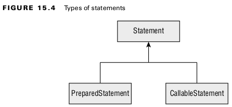
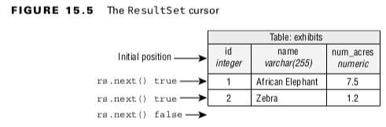

## Introducing the Interfaces of JDBC
- **Driver**: Establishes a connection to the database
- **Connection**: Sends commands to a database
- **PreparedStatement**: Executes a SQL query
- **CallableStatement**: Executes commands stored in the database
- **ResultSet**: Reads the results of a query
  <br>

## Connecting to a Database
#### Building a JDBC URL
- jdbc:**postgresql**://localhost/zoo
- jdbc:**oracle**:thin:@123.123.123.123:1521:zoo
- jdbc:**mysql**://localhost:3306
- jdbc:**mysql**://localhost:3306/zoo?profileSQL=true
  <br>

#### Getting a Database Connection
```
public static void main(String[] args) throws SQLException {
    try (Connection conn = DriverManager.getConnection(
        "jdbc:postgresql://localhost:5432/ocp-book",
        "username",
        "Password20182")) {
            System.out.println(conn);
    }
}
```
<br>

## Working with a PreparedStatement

<br>

#### PreparedStatement is far superior for the following reasons:
- **Performance**: In most programs, you run similar queries multiple times. When you use
- **PreparedStatement**, the database software often devises a plan to run the query well and remembers it.
- **Security**: You are protected against an attack called SQL injection when using a PreparedStatement correctly.
- **Readability**: It’s nice not to have to deal with string concatenation in building a query string with lots of parameters.
- **Future use**: Even if your query is being run only once or doesn’t have any parameters, you should still use a PreparedStatement . That way, future editors of the code won’t add a variable and have to remember to change to PreparedStatement then.
  <br>

#### Obtaining a PreparedStatement
```
try (PreparedStatement ps = conn.prepareStatement("SELECT * FROM exhibits")) {
    // work with ps
}
```
<br>

- An instance of a **PreparedStatement** represents a SQL statement that you want to run using the Connection . It does not execute the query yet!
<br>

#### Executing a PreparedStatement
- DELETE , INSERT , or UPDATE, they typically use a method called **executeUpdate()**.
<br>

#### Modifying Data with executeUpdate()
<br>

```
var insertSql = "INSERT INTO exhibits VALUES(10, 'Deer', 3)";
try (var ps = conn.prepareStatement(insertSql)) {
    int result = ps.executeUpdate();
    System.out.println(result); // 1
}
```
<br>

#### Reading Data with executeQuery()
```
var sql = "SELECT * FROM exhibits";
try (var ps = conn.prepareStatement(sql);
    ResultSet rs = ps.executeQuery() ) {
    // work with rs
}
```
<br>

#### Reviewing PreparedStatement Methods

#### Table: 15.3 SQL runnable by the execute method
| Method              | DELETE | INSERT | SELECT | UPDATE |
|---------------------|--------|--------|--------|--------|
| ps.execute()        | Yes    | Yes    | Yes    | Yes    |
| ps.executeQuery()   | No     | No     | Yes    | No     |
| ps.executeUpdate(); | Yes    | Yes    | No     | Yes    |
<br>

#### Table: 15.4 SQL Return types of execute methods
| Method              | Return Type | What is returned for SELECT | What is returned for DELETE/INSERT/UPDATE |
|---------------------|-------------|-----------------------------|-------------------------------------------|
| ps.execute()        | boolean     | true                        | false                                     |
| ps.executeQuery()   | ResultSet   | Rows and columns returned   | n/a                                       | 
| ps.executeUpdate(); | int         | n/a                         | Number of rows added/changed/removed      | 
<br>

#### Working with Parameters
- A **PreparedStatement** allows us to set parameters. Instead of specifying the three values in the SQL, we can use a question mark (?). A bind variable is a placeholder that lets you specify the actual values at runtime.
<br>
-
```
String sql = "INSERT INTO names VALUES(?, ?, ?)";
try (PreparedStatement ps = conn.prepareStatement(sql)) {
    ps.setString(3, name);
    ps.setInt(2, type);
    ps.executeUpdate();
}
```
<br>

#### Table: 15.5 PreparedStatement methods
| Method     | Parameter Type | Example database type | 
|------------|----------------|-----------------------|
| setBoolean | boolean        | BOOLEAN               | 
| setDouble  | double         | DOUBLE                | 
| setInt     | int            | INTEGER               | 
| setLong    | long           | BIGINT                | 
| setNull    | int            | Any type              | 
| setObject  | Object         | Any type              |  
| setString  | String         | CHAR, VARCHAR         | 
<br>

#### Getting Data from a ResultSet
```
String sql = "SELECT id, name FROM exhibits";
var idToNameMap = new HashMap<Integer, String>();

try (var ps = conn.prepareStatement(sql);
    ResultSet rs = ps.executeQuery()) {
    while (rs.next()) {
        int id = rs.getInt("id");
        String name = rs.getString("name");
        idToNameMap.put(id, name);
    }
    System.out.println(idToNameMap);
}
```
<br>

A **ResultSet** has a cursor, which points to the current location in the data.
<br>



```
int id = rs.getInt(1);
String name = rs.getString(2);
```
<br>

- The result set cursor is still pointing to a location before the first row, so the getter has nothing to point to.
- Always use an if statement or while loop when calling rs.next().
- Column indexes begin with 1.
<br>

### Getting Data for a Column 
#### Table: 15.6 ResultSet get methods
| Method     | Return type |
|------------|-------------|
| getBoolean | boolean     |
| getDouble  | double      |
| getInt     | int         |
| getLong    | long        |
| getObject  | Object      |
| getString  | String      |
<br>

- The **getObject()** method can return any type.
<br>

### Calling a CallableStatement
- A **stored procedure** is code that is compiled in advance and stored in the database.
<br>

#### Table: 15.3 SQL runnable by the execute method
| Name                   | Parameter name | Parameter type | Description                                                                                         | 
|------------------------|----------------|----------------|-----------------------------------------------------------------------------------------------------|
| read_e_names()         | n/a            | n/a            | Returns all rows in manes table that have name beginning with e or E                                | 
| read_names_by_letter() | prefix         | IN             | Returns all rows in manes table that have name beginning with specified parameter(case insensitive) | 
| magic_number();        | num            | OUT            | Returns number 42                                                                                   | 
| double_number();       | num            | INOUT          | Multiplies parameter by two and returns that number                                                 | 
<br>

### Calling a Procedure without Parameters
```
String sql = "{call read_e_names()}";
try (CallableStatement cs = conn.prepareCall(sql);
    ResultSet rs = cs.executeQuery()) {
}
```
<br>

### Passing an IN Parameter
```
var sql = "{call read_names_by_letter(?)}";
try (var cs = conn.prepareCall(sq)){
    cs.setString("prefix", "Z");
}
```
<br>

### Returning an OUT Parameter
```
var sql = "{?= call magic_number(?) }";
try (var cs = conn.prepareCall(sql)) {
    cs.registerOutParameter(1, Types.INTEGER);
    cs.execute();
}
```
<br>

- Braces ( {} )
- Bind variable ( ? ) if it is an OUT parameter
- Call to registerOutParameter()

### Working with an INOUT Parameter
```
var sql = "{call double_number(?)}";
try (var cs = conn.prepareCall(sql)) {
    cs.setInt(1, 8);
    cs.registerOutParameter(1, Types.INTEGER);
    cs.execute();
    System.out.println(cs.getInt("num"));
}
```
<br>

### Comparing Callable Statement Parameters
| Name                             | IN  | OUT | INOUT | 
|----------------------------------|-----|-----|-------|
| Used for input                   | Yes | No  | Yes   | 
| Used for output                  | No  | No  | Yes   | 
| Must set parameter value         | Yes | OUT | Yes   | 
| Must call registerOutParameter() | No  | Yes | Yes   |
| Can include =?                   | No  | Yes | Yes   |
<br>

### Using Additional Options
There are three ResultSet integer type values:
- ResultSet.TYPE_FORWARD_ONLY : Can go through the ResultSet only one row at a time
- ResultSet.TYPE_SCROLL_INSENSITIVE : Can go through the ResultSet in any order but will not see changes made to the underlying database table
- ResultSet.TYPE_SCROLL_SENSITIVE : Can go through the ResultSet in any order and will see changes made to the underlying database table
<br>

### There are two ResultSet integer concurrency mode values:
- ResultSet.CONCUR_READ_ONLY : The ResultSet cannot be updated.
- ResultSet.CONCUR_UPDATABLE : The ResultSet can be updated.