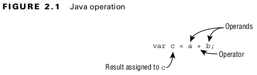

## Operators

#### Understanding Java Operators


#### Operator Precedence
- Determining which operators are evaluated in what order is referred to as operator precedence.


#### Table: 2.1 Order of operator precedence
| Operator                        | Symbols and examples                           | Evaluation    | 
|---------------------------------|------------------------------------------------|---------------|
| Post-unary operators            | expression++, expression--                     | Left-to-right |
| Pre-unary operators             | ++expression, --expression                     | Left-to-right |
| Other unary operators           | -, !, ~, +, (type)                             | Right-to-left |
| Cast                            | (Type)reference                                | Right-to-left |
| Multiplication/division/modulus | *, /, %                                        | Left-to-right |
| Addition/subtraction            | +, -                                           | Left-to-right |
| Shift operators                 | <<, >>, >>>                                    | Left-to-right |
| Relational operators            | <, >, <=, >=, instanceof                       | Left-to-right |
| Equal to/not equal to           | ==, !=                                         | Left-to-right |
| Logical AND                     | &                                              | Left-to-right |
| Logical exclusive OR            | ^                                              | Left-to-right |
| Logical inclusive OR            | \|                                             | Left-to-right |
| Conditional AND                 | &&                                             | Left-to-right |
| Conditional OR                  | \|\|                                           | Left-to-right |
| Ternary operators               | boolean expression ? expression1 : expression2 | Right-to-left |
| Assignment operators            | =, +=, -=, *=, /=, %=, &=, ^=,                 | Right-to-left |  
| Arrow operator                  | ->                                             | Right-to-left | 

#### Applying Unary Operators
- A unary operator is one that requires exactly one operand, or variable, to function.

#### Table: 2.2 Unary operators
| Operator           | Examples    | Description                                                                                                                         | 
|--------------------|-------------|-------------------------------------------------------------------------------------------------------------------------------------|
| Logical complement | !a          | Inverts a boolean ’s logical value                                                                                                  | 
| Bitwise complement | ~b          | Inverts all 0 s and 1 s in a number                                                                                                 | 
| Plus               | +c          | Indicates a number is positive, although numbers are assumed to be positive in Java unless accompanied by a negative unary operator | 
| Negation or minus  | -d          | Indicates a literal number is negative or negates an expression                                                                     | 
| Increment          | ++e <br>f++ | Increments a value by 1                                                                                                             | 
| Decrement          | --f <br>h-- | Decrements a value by 1                                                                                                             |  
| Cast               | (String)i   | Casts a value to a specific type                                                                                                    | 

#### Increment and Decrement Operators
#### Table: 2.3 Increment and decrement operators
| Operator       | Examples | Description                                             | 
|----------------|----------|---------------------------------------------------------|
| Pre-increment  | ++w      | Increases the value by 1 and returns the new value      | 
| Pre-decrement  | --x      | Decreases the value by 1 and returns the new value      | 
| Post-increment | y++      | Increases the value by 1 and returns the original value | 
| Post-decrement | z--      | Decreases the value by 1 and returns the original value | 

### Numeric Promotion
#### Numeric Promotion Rules:

1. If two values have different data types, Java will automatically promote one of the values to the larger of the two data types.
2. If one of the values is integral and the other is floating-point, Java will automatically promote the integral value to the floating-point value’s data type.
3. Smaller data types, namely, byte , short , and char , are first promoted to int any time they’re used with a Java binary arithmetic operator with a variable (as opposed to a value), even if neither of the operands is int .
4. After all promotion has occurred and the operands have the same data type, the resulting value will have the same data type as its promoted operands.

```
System.out.println(2+"");
```

- Whenever only one operand of the + operator is a String, the other operand is converted into a String using a string conversion. If the other operand is a numeric primitive type, then it is first converted to a reference type using the boxing conversion and then the boxed reference is used to produce a String.
- Thus, in this case, 2 will first be boxed into an Integer object and then the Integer object will be used to produce the String "2", which will then be concatenated with "".
- Hence, this is a also a valid example where autoboxing occurs.
- Note that, no autoboxing occurs in System.out.println(2); because the println(int ) method is invoked in this case.
<br>

#### Compound Assignment Operators
#### Table: 2.6 Compound assignment operators
| Operator                  | Examples | Description                                                                                               | 
|---------------------------|----------|-----------------------------------------------------------------------------------------------------------|
| Addition assignment       | a += 5   | Adds the value on the right to the variable on the left and assigns the sum to the variable               | 
| Subtraction assignment    | b -= 0.2 | Subtracts the value on the right from the variable on the left and assigns the difference to the variable | 
| Multiplication assignment | c *= 100 | Multiplies the value on the right with the variable on the left and assigns the product to the variable   | 
| Division assignment       | d /= 4   | Divides the variable on the left by the value on the right and assigns the quotient to the variable       | 

#### The compound operator
#### Explanation:
```
long goat = 10;
int sheep = 5;
sheep *= goat;
```

- The compound operator will first cast sheep to a long, apply the multiplication of two long values, and then cast the result to an int. Unlike the previous example, in which the compiler reported an error, the compiler will automatically cast the resulting value to the data type of the value on the left side of the compound operator.

#### Equality Operators
#### Table: 2.7 Equality operators
| Operator   | Example   | Apply to primitives                                       | Apply to objects                                                | 
|------------|-----------|-----------------------------------------------------------|-----------------------------------------------------------------|
| Equality   | a == 10   | Returns true if the two values represent the same value   | Returns true if the two values reference the same object        | 
| Inequality | b != 3.14 | Returns true if the two values represent different values | Returns true if the two values do not reference the same object | 

#### Relational Operators
#### Table: 2.8 Relational operators
| Operator                 | Examples            | Description                                                                                                                              | 
|--------------------------|---------------------|------------------------------------------------------------------------------------------------------------------------------------------|
| Less than                | a < 5               | Returns true if the value on the left is strictly less than the value on the right                                                       | 
| Less than or equal to    | b <= 6              | Returns true if the value on the left is less than or equal to the value on the right                                                    | 
| Greater than             | c > 9               | Returns true if the value on the left is strictly greater than the value on the right                                                    | 
| Greater than or equal to | 3 >= d              | Returns true if the value on the left is greater than or equal to the value on the right                                                 | 
| Type comparison          | e instanceof String | Returns true if the reference on the left side is an instance of the type on the right side (class, interface, record, enum, annotation) |

#### Logical Operators
#### Table: 2.9 Logical operators
| Operator             | Examples | Description                                                     | 
|----------------------|----------|-----------------------------------------------------------------|
| Logical AND          | a & b    | Value is true only if both values are true.                     | 
| Logical inclusive OR | c \| d   | Value is true if at least one of the values is true.            | 
| Logical exclusive OR | e ^ f    | Value is true only if one value is true and the other is false. | 

###### Here are some tips to help you remember this table:
- AND is only true if both operands are true.
- Inclusive OR is only false if both operands are false.
- Exclusive OR is only true if the operands are different.
  
#### Conditional Operators
#### Table: 2.10 Conditional operators
| Operator        | Examples | Description                                                                                                               | 
|-----------------|----------|---------------------------------------------------------------------------------------------------------------------------|
| Conditional AND | a && b   | Value is true only if both values are true.                                                                               | 
| Conditional OR  | c \|\| d | Value is true if at least one of the values is true. If the left side is true, then the right side will not be evaluated. |