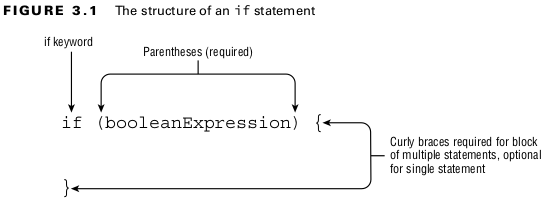
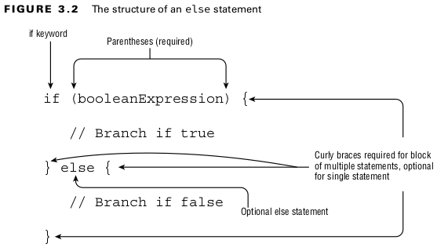
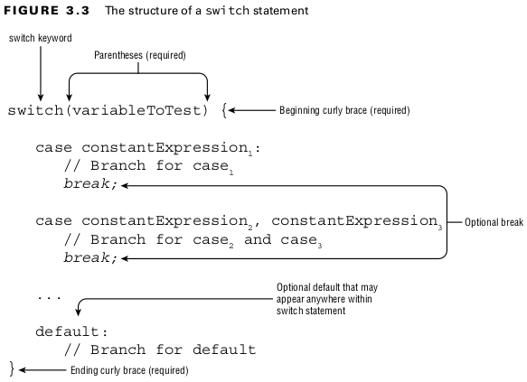
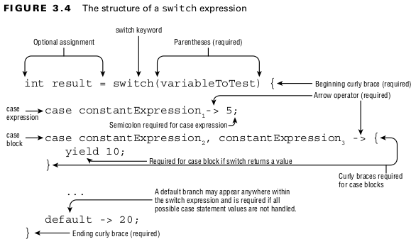
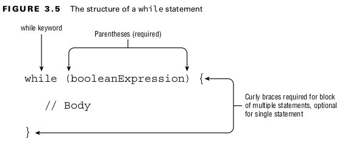
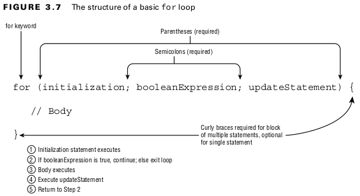
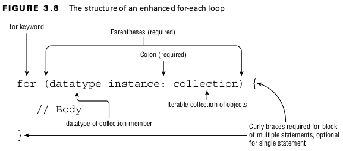
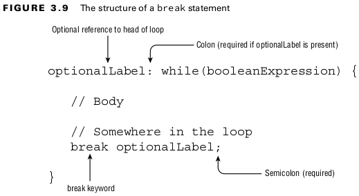

## Making Decisions
### Creating Decision-Making Statements
#### The if Statement

<br>

#### The else Statement

<br>

#### Shortening Code with Pattern Matching

- Code that first checks if a variable is of a particular type and then immediately casts it to that type is extremely common in the Java world.
```
void compareIntegers(Number number) {
    if(number instanceof Integer data) {
        System.out.print(data.compareTo(5));
    }
}
```
<br>

#### Pattern Variables and Expressions
```
void printIntegersGreaterThan5(Number number) {
    if(number instanceof Integer data && data.compareTo(5)>0)
        System.out.print(data);
}
```
<br>

#### Subtypes
- The type of the pattern variable must be a subtype of the variable on the left side of the
  expression.
<br>

```
Integer value = 123;
if(value instanceof Integer data) {} // DOES NOT COMPILE
```
<br>

- does not compile because pattern matching requires that the pattern variable type Integer be a strict subtype of Integer.
- Given the non-final class Number and interface List , this does compile even though they are unrelated:
<br>

```
Number value = 123;
if(value instanceof List data) {}
```
<br>


#### Flow Scoping
- Flow scoping means the variable is only in scope when the compiler can definitively determine its type.
```
void printIntegerTwice(Number number) {
    if (number instanceof Integer data)
        System.out.print(data.intValue());
    System.out.print(data.intValue()); // DOES NOT COMPILE
}
```
<br>

- So you might be thinking that the pattern variable is then only in scope inside the if statement, right? Well, not exactly!
```
void printOnlyIntegers(Number number) {
    if (!(number instanceof Integer data))
        return;
    System.out.print(data.intValue());
}
```

### Applying switch Statements
#### The switch Statement

<br>

#### Exiting with break Statements
- The break statements are optional, but without them the code will execute every branch following a matching case statement, including any default statements it finds.
<br>

#### Selecting switch Data Types
- The type of this target can include select primitive data types (int, byte, short, char) and their associated wrapper classes (Integer, Byte, Short, Character).
- The following is a list of all data types supported by switch statements:
<br>

- int and Integer
- byte and Byte
- short and Short
- char and Character
- String
- enum values
- var (if the type resolves to one of the preceding types)

#### Determining Acceptable Case Values
- The values in each case statement must be compile-time constant values of the same data type as the switch value. This means you can use only literals, enum constants, or final constant variables of the same data type.
- You can’t have a case statement value that requires executing a method at runtime, even if that method always returns the same value.
- The value can be resolved at compile-time.

#### The switch Expression

<br>

- A switch expression supports zero or many case branches and an optional default branch.
```
var result = switch(bear) {
    case 30 -> "Grizzly";
    default -> "Panda";
};
```
<br>

#### rules
1. All of the branches of a switch expression that do not throw an exception must return a consistent data type (if the switch expression returns a value).
2. If the switch expression returns a value, then every branch that isn’t an expression must yield a value.
3. A default branch is required unless all cases are covered or no value is returned.
<br>

#### Returning Consistent Data Types
- You can’t return incompatible or random data types.
<br>

#### Applying a case Block
- ***yield*** statement if the switch expression returns a value.
- A case block is one that is surrounded by braces ({})
<br>

#### Covering All Possible Values
- You can include an optional default branch, though, even if you cover all known values.
- if you use an enum with three values and later someone adds a fourth value? Any switch expressions that use the enum without a default branch will suddenly fail to compile.
<br>

## Writing while Loops
#### The while Statement

<br>

## Constructing for Loops
#### The for Loop

<br>

#### The for-each Loop

<br>

- A built-in Java array
- An object whose type implements java.lang.Iterable
- Map is not supported in a for-each loop, although Map does include methods that return Collection instances.
- While a String may represent a list of characters, it has to actually be an array or implement Iterable.
<br>

### Controlling Flow with Branching
#### Nested Loops
#### Adding Optional Labels
- A label is an optional pointer to the head of a statement that allows the application flow to jump to it or break from it. It is a single identifier that is followed by a colon (:).

```
int[][] myComplexArray = {{5,2,1,3},{3,9,8,9},{5,7,12,7}};
OUTER_LOOP: for(int[] mySimpleArray : myComplexArray) {
    INNER_LOOP: for(int i=0; i<mySimpleArray.length; i++) {
        System.out.print(mySimpleArray[i]+"\t");
    }
    System.out.println();
}
```
<br>

#### The break Statement
- A ***break*** statement transfers the flow of control out to the enclosing statement.


<br>

- The ***continue*** statement transfers control to the boolean expression that determines if the loop should continue.
<br>

#### The return Statement
- The ***return*** statements can be used to exit loops quickly and can lead to more readable code in practice.
<br>

#### Unreachable Code
- ***break***, ***continue***, and ***return***. any code placed immediately after them in the same block is considered unreachable and will not compile.
<br>

#### Reviewing Branching
#### Table: 3.1 Control statement usage
|          | Support labels | Support labels | Support continue | Support yield |
|----------|----------------|----------------|------------------|---------------|
| while    | Yes            | Yes            | Yes              | No            |
| do/while | Yes            | Yes            | Yes              | No            |
| for      | Yes            | Yes            | Yes              | No            |
| switch   | Yes            | Yes            | No               | Yes           |
<br>