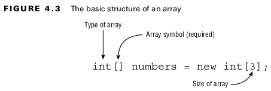
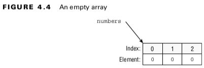
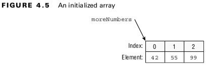
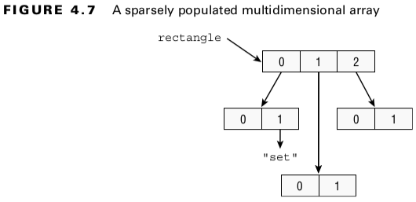
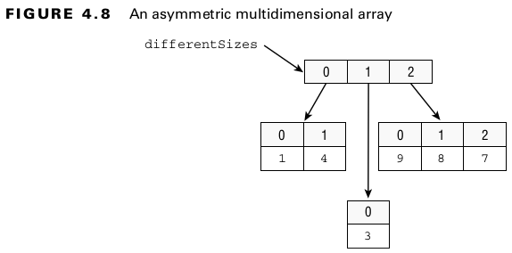
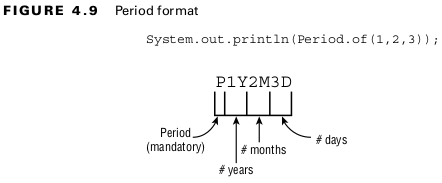
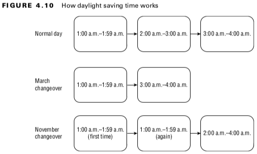

## Core APIs

### Creating and Manipulating Strings
- A ***String*** is basically a sequence of characters.
<br>

#### Removing Whitespace
- The ***strip()*** and ***trim()*** methods remove whitespace from the beginning and end of a String. but it supports Unicode.
- The ***stripLeading()*** method removes whitespace from the beginning of the String and leaves it at the end.
- The ***stripTrailing()*** method removes whitespace from the end of the String and leaves it at the beginning.

- \t (tab)
- \n (newline) characters.
- \r (carriage return)
- char ch = '\u2000';
<br>

#### Working with Indentation
- The ***indent() method*** adds the same number of blank spaces to the beginning of each line if you pass a positive number.
- If you pass a negative number, it tries to remove that number of whitespace characters from the beginning of the line.
<br>

#### Table: 4.1 Rules for indent() and stripIndent()
| Method                 | Indent change                                                                                                 | Normalizes existing line breaks | Adds line break at end if missing | 
|------------------------|---------------------------------------------------------------------------------------------------------------|---------------------------------|-----------------------------------|
| indent(n) where n > 0  | Adds n spaces to beginning of each line                                                                       | Yes                             | Yes                               | 
| indent(n) where n == 0 | No change                                                                                                     | Yes                             | Yes                               | 
| indent(n) where n < 0  | Removes up to n spaces from each line where the same number of characters is removed from each non-blank line | Yes                             | Yes                               | 
| stripIndent()          | Removes all leading incidental whitespace                                                                     | Yes                             | No                                | 
<br>

#### Translating Escapes
- The ***translateEscapes() method*** takes these literals and turns them into the equivalent escaped character.
<br>

#### Formatting Values
- In the ***format()*** and ***formatted()*** operations, the parameters are inserted and formatted via symbols in the order that they are provided in the vararg.
<br>

#### Table: 4.2 Common formatting symbols
| Symbol | Description                                                    |
|--------|----------------------------------------------------------------|
| %s     | Applies to any type, commonly String values                    |
| %d     | Applies to integer values like int and long                    |
| %f     | Applies to floating-point values like float and double         |
| %n     | Inserts a line break using the system-dependent line separator |
<br>

## Using the StringBuilder Class
#### Mutability and Chaining
- StringBuilder is not immutable.
- The StringBuilder changes its own state and returns a reference to itself.
<br>

#### Appending Values
- It adds the parameter to the StringBuilder and returns a reference to the current StringBuilder.
<br>

#### Inserting Data
- The ***insert()*** method adds characters to the StringBuilder at the requested index and returns a reference to the current StringBuilder.
<br>

#### Deleting Contents
- The ***delete()*** method it removes characters from the sequence and returns a reference to the current StringBuilder.
- The ***deleteCharAt()*** method is convenient when you want to delete only one character.
<br>

#### Reversing
- The ***reverse()*** method does just what it sounds like: it reverses the characters in the sequences and returns a reference to the current ***StringBuilder***.
<br>

## Understanding Equality
#### The String Pool
- The ***intern()*** method will use an object in the string pool if one is present.
<br>

## Understanding Arrays
#### Creating an Array of Primitives

<br>


<br>

```
int[] moreNumbers = new int[] {42, 55, 99};
```
<br>


<br>

#### Sorting
- Arrays.sort()
- Arrays requires an import.
<br>

```
import java.util.*;  // import whole package including Arrays
import java.util.Arrays; // import just Arrays
String[] strings = { "10", "9", "100" };
Arrays.sort(strings);
```
<br>

- This code outputs 10 100 9.
- The problem is that String sorts in alphabetic order, and 1 sorts before 9. (Numbers sort before letters, and uppercase sorts before lowercase.)
<br>

#### Searching
#### Table: 15.6 ResultSet get methods
| Scenario                                 | Result                                                                                                                         |
|------------------------------------------|--------------------------------------------------------------------------------------------------------------------------------|
| Target element found in sorted array     | Index of match                                                                                                                 |
| Target element not found in sorted array | Negative value showing one smaller than the negative of the index, where a match needs to be inserted to preserve sorted order |
| Unsorted array                           | A surprise; this result is undefined                                                                                           |
<br>

#### Using compare()
- A ***negative number*** means the first array is smaller than the second.
- A ***zero*** means the arrays are equal.
- A ***positive number*** means the first array is larger than the second.
<br>

Now that you know how to compare a single value, let’s look at how to compare arrays of different lengths:

- If both arrays are the same length and have the same values in each spot in the same order, return zero.
- If all the elements are the same but the second array has extra elements at the end, return a negative number.
- If all the elements are the same, but the first array has extra elements at the end, return a positive number.
- If the first element that differs is smaller in the first array, return a negative number.
- If the first element that differs is larger in the first array, return a positive number.
<br>

Finally, what does smaller mean? Here are some more rules that apply here and to compareTo()

- null is smaller than any other value.
- For numbers, normal numeric order applies.
- For Strings, one is smaller if it is a prefix of another.
- For Strings/characters, numbers are smaller than letters.
- For Strings/characters, uppercase is smaller than lowercase.
<br>

#### Table: 4.4 Arrays.compare() examples
| First array        | Second array        | Result          | Reason                                                        | 
|--------------------|---------------------|-----------------|---------------------------------------------------------------|
| new int[] {1, 2}   | new int[] {1}       | Positive number | The first element is the same, but the first array is longer. |
| new int[] {1, 2}   | new int[] {1, 2}    | Zero            | Exact match                                                   |
| new String[] {"a"} | new String[] {"aa"} | Negative number | The first element is a substring of the second.               |
| new String[] {"a"} | new String[] {"A"}  | Positive number | Uppercase is smaller than  lowercase.                         |
| new String[] {"a"} | new String[] {null} | Positive number | null is smaller than a letter.                                |
<br>


#### Using mismatch()
- The arrays are the same, so the result is -1.
- the entries at element 0 are not equal, so the result is 0.
- One array has an element at index 1, and the other does not. Therefore, the result is 1 .
<br>

#### Table: 4.5 Equality vs. comparison vs. mismatch
| Method     | When arrays contain the same data | When arrays are different   | 
|------------|-----------------------------------|-----------------------------|
| equals()   | true                              | false                       | 
| compare()  | 0                                 | Positive or negative number | 
| mismatch() | -1                                | Zero or positive index      |  
<br>

## Working with Multidimensional Arrays
#### Creating a Multidimensional Array
```
int[][] vars1; // 2D array
int vars2 [][]; // 2D array
int[] vars3[]; // 2D array
int[] vars4 [], space [][]; // a 2D AND a 3D array
```
<br>


<br>


<br>

```
int [][] args = new int[4][];
args[0] = new int[5];
args[1] = new int[3];
```
<br>

## Calculating with Math APIs
#### Finding the Minimum and Maximum
- The ***min()*** and ***max()*** methods compare two values and return one of them.
<br>

#### Rounding Numbers
- The ***round()*** method gets rid of the decimal portion of the value, choosing the next higher number if appropriate. If the fractional part is .5 or higher, we round up.
<br>

#### Determining the Ceiling and Floor
- The ***ceil()*** method takes a double value. If it is a whole number, it returns the same value. If it has any fractional value, it rounds up to the next whole number.
- The ***floor()*** method discards any values after the decimal.
<br>

#### Calculating Exponents
- The pow() method handles exponents.
<br>

## Working with Dates and Times
#### Creating Dates and Times
- ***LocalDate*** Contains just a date-no time and no time zone.
- ***LocalTime*** Contains just a time-no date and no time zone.
- ***LocalDateTime*** Contains both a date and time but no time zone.
- ***ZonedDateTime*** Contains a date, time, and time zone.
- a static method called ***now()***, which gives the current date and time.
<br>

```
public static LocalDate of(int year, int month, int dayOfMonth);
public static LocalDate of(int year, Month month, int dayOfMonth);
```
<br>

## Manipulating Dates and Times
- The date and time classes are immutable.
<br>

#### Table: 4.6 Methods in LocalDate, LocalTime, LocalDateTime, and ZonedDateTime
|                                  | Can call on LocalDate? | Can call on LocalTime? | Can call on LocalDateTime or ZonedDateTime? | 
|----------------------------------|------------------------|------------------------|---------------------------------------------|
| plusYears() <br>minusYears()     | Yes                    | No                     | Yes                                         | 
| plusMonths() <br>minusMonths()   | Yes                    | No                     | Yes                                         | 
| plusWeeks() <br>minusWeeks()     | Yes                    | No                     | Yes                                         | 
| plusDays() <br>minusDays()       | Yes                    | No                     | Yes                                         | 
| plusHours() <br>minusHours()     | No                     | Yes                    | Yes                                         | 
| plusMinutes() <br>minusMinutes() | No                     | Yes                    | Yes                                         | 
| plusSeconds() <br>minusSeconds() | No                     | Yes                    | Yes                                         | 
| plusNanos() <br>minusNanos()     | No                     | Yes                    | Yes                                         |
<br>

#### Working with Periods
- A Period is a day or more of time.
- You cannot chain methods when creating a Period.
- The ***of()*** method takes only years, months, and days.
<br>


<br>

- If any of these are zero, they are omitted.

#### Working with Durations
- is intended for smaller units of time.
- You can specify the number of days, hours, minutes, seconds, or nanoseconds.
- Duration works roughly the same way as Period, except it is used with objects that have time.
- Duration doesn’t have a factory method that takes multiple units like Period does.
<br>

#### Period vs. Duration
#### Table: 4.7 Where to use Duration and Period
|               | Can use with Period ? | Can use with Duration ? | 
|---------------|-----------------------|-------------------------|
| LocalDate     | Yes                   | No                      | 
| LocalDateTime | Yes                   | Yes                     | 
| LocalTime     | No                    | Yes                     | 
| ZonedDateTime | Yes                   | Yes                     |
<br>

#### Working with Instants
- The ***Instant class*** represents a specific moment in time in the GMT time zone.
- You cannot convert a ***LocalDateTime*** to an Instant.
- A ***LocalDateTime*** does not contain a time zone.
<br>

#### Accounting for Daylight Saving Time
