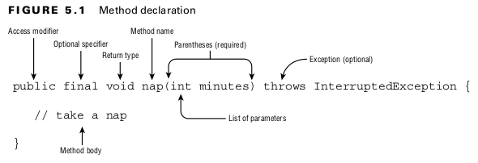

## Methods
### Designing Methods

- The method name and parameter list-are called the method signature.
- The method signature does not include the return type and access modifiers.
 

#### Table: 5.1 Parts of a method declaration in Figure 5.1
| Element            | Value in nap() example      | Required?                         | 
|--------------------|-----------------------------|-----------------------------------|
| Access modifier    | public                      | No                                | 
| Optional specifier | final                       | No                                | 
| Return type        | void                        | Yes                               | 
| Method name        | nap                         | Yes                               | 
| Parameter list     | (int minutes)               | Yes, but can be empty parentheses | 
| Method signature   | nap(int minutes)            | Yes                               |  
| Exception list     | throws InterruptedException | No                                | 
| Method body        | { // take a nap }           | Yes, except for abstract methods  | 
 

#### Access Modifiers
- private The private modifier means the method can be called only from within the same class.
- package Access the method can be called only from a class in the same package. as package-private or default access.
- protected can be called only from a class in the same package or a subclass.
- public The public modifier means the method can be called from anywhere.
 

#### Optional Specifiers

#### Table: 5.2 Optional specifiers for methods
| Modifier     | Description                                                                                                   |
|--------------|---------------------------------------------------------------------------------------------------------------|
| static       | Indicates the method is a member of the shared class object                                                   |
| abstract     | Used in an abstract class or interface when the method body is excluded                                       |
| final        | Specifies that the method may not be overridden in a sub-class                                                |
| default      | Used in an interface to provide a default implementation of a method for classes that implement the interface |
| synchronized | Used with multithreaded code                                                                                  |
| native       | Used when interacting with code written in another language, such as C++                                      |
| strictfp     | Used for making floating-point calculations portable                                                          |
 

- access modifiers and optional specifiers can appear in any order, they must all appear before the return type.
- access modifiers and optional specifiers can be listed in any order, but once the return type is specified, the rest of the parts of the method are written in a specific order
 

#### Method Name
- May only contain letters, numbers, currency symbols, or _ . Also, the first character is not allowed to be a number, and reserved words are not allowed. Finally, the single underscore character is not allowed.

#### Parameter List
#### Method Signature
- Composed of the method name and parameter list
 

#### Exception List
- You can list as many types of exceptions as you want in this clause, separated by commas.
 

## Declaring Local and Instance Variables
- local variables are those defined with a method or block, while instance variables are those that are defined as a member of a class.
 

#### Local Variable Modifiers
- There’s only one modifier that can be applied to a local variable: final.
- We can even use var and final together.
- The final attribute only refers to the variable reference; the contents can be freely modified (assuming the object isn’t immutable).
 

#### Effectively Final Variables
- An effectively final local variable is one that is not modified after it is assigned. This means that the value of a variable doesn’t change after it is set.
- since local classes and lambda expressions declared within a method can only reference local variables that are final or effectively final. 
 

#### Instance Variable Modifiers
#### Table: 15.6 ResultSet get methods
| Modifier  | Description                                                                                           |
|-----------|-------------------------------------------------------------------------------------------------------|
| final     | Specifies that the instance variable must be initialized with each instance of the class exactly once |
| volatile  | Instructs the JVM that the value in this variable may be modified by other threads                    |
| transient | Used to indicate that an instance variable should not be serialized with the class                    |
 

- instance variables can use access modifiers, such as private, package, protected, and public.
- package access is indicated by the lack of any modifiers.

- If an instance variable is marked final, then it must be assigned a value when it is declared or when the object is instantiated. Like a local final variable, it cannot be assigned a value more than once.

## Working with Varargs
#### Creating Methods with Varargs
1. A method can have at most one varargs parameter.
2. If a method contains a varargs parameter, it must be the last parameter in the list.
 

#### Applying Access Modifiers
- private: Only accessible within the same class.
- package access: private plus other members of the same package. Sometimes referred to as package-­private or default access.
- protected: package access plus access within subclasses.
- public: protected plus classes in the other packages.
 

#### Reviewing Access Modifiers
#### Table: 5.4 A method in ___ can access a ___ member.
|                                           | private | package | protected | public |
|-------------------------------------------|---------|---------|-----------|--------|
| the same class                            | Yes     | Yes     | Yes       | Yes    |
| another class in the same package         | No      | Yes     | Yes       | Yes    |
| a subclass in a different package         | No      | No      | Yes       | Yes    |
| an unrelated class in a different package | No      | No      | No        | Yes    |
 

## Accessing static Data

- static keyword is applied to a variable, method, or class.
- import statements.
 

#### Designing static Methods and Variables
- Methods and variables declared static don’t require an instance of the class.
- You can think of a static variable as being a member of the single class object that exists independently of any instances of that class.
 

#### Accessing a static Variable or Method
- You just put the class name before the method or variable, and you are done.
- to look at the reference type for a variable when you see a static method or variable.
 

#### Class vs. Instance Membership
- A static member cannot call an instance member without referencing an instance of the class.
- A static method or instance method can call a static method because static methods don’t require an object to use.
- Only an instance method can call another instance method on the same class without using a reference variable.
- Fact that static (and instance) variables are automatically initialized to the default value for that type, which is 0 for int.
- a static method cannot call an instance method without a reference.
 

#### static Variable Modifiers
- This type of static variable is known as a constant. It uses the final modifier to ensure the variable never changes.
- They use all uppercase letters with underscores between “words.”
- The compiler will make sure that you do not accidentally try to update a final variable.
- We are allowed to modify the referenced object or array’s contents.
- Can do is check that we don’t try to reassign treats to point to a different object.
- Is assigned a value in a static initializer.
- final variables must be initialized with a value.
 

#### static Initializers
- They should be run when the class is first loaded.
- All static initializers run when the class is first used, in the order they are defined.
- final variables aren’t allowed to be reassigned.
 

#### static Imports
- Regular imports are for importing classes, while static imports are for importing static members of classes like variables and methods.
 

## Passing Data among Methods
#### Autoboxing and Unboxing Variables
- Autoboxing is the process of converting a primitive into its equivalent wrapper class, while unboxing is the process of converting a wrapper class into its equivalent primitive.
- int value can be implicitly cast to a long.
- the int value is autoboxed to an Integer.
- long must be explicitly cast to an int.
- Java will not automatically convert to a narrower type.
- Java will cast or autobox the value automatically, but not both at the same time.

#### Overloading Methods
- Method overloading occurs when methods in the same class have the same name but different method signatures, which means they use different parameter lists.
- there can be different access modifiers, optional specifiers (like static ), return types, and exception lists.
 

#### Primitives
- Java tries to find the most specific matching overloaded method.
 

#### Autoboxing
- Java tries to use the most specific parameter list it can find. This is true for autoboxing as well as other matching types
 

#### Putting It All Together
#### Table: 5.6 The order that Java uses to choose the right overloaded method
| Rule                  | Example of what will be chosen for glide(1,2) |
|-----------------------|-----------------------------------------------|
| Exact match by type   | String glide(int i, int j)                    |
| Larger primitive type | String glide(long i, long j)                  |
| Autoboxed type        | String glide(Integer i, Integer j)            |
| Varargs               | String glide(int... nums)                     |
 