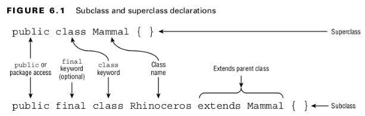

#### Understanding Inheritance
- Inheritance is the process by which a subclass automatically includes certain members
  of the class, including primitives, objects, or methods, defined in the parent class.
 

#### Declaring a Subclass

 

- all public and protected members are automatically available as part of the child class. If the two classes are in the same package, then package members are available to the child class.
- private members are restricted to the class they are defined in and are never available via inheritance.
 

#### Class Modifiers
#### Table: 15.6 ResultSet get methods
| Modifier   | Description                                                                                           |
|------------|-------------------------------------------------------------------------------------------------------|
| final      | The class may not be extended.                                                                        |
| abstract   | The class is abstract, may contain abstract methods, and requires a concrete subclass to instantiate. |
| sealed     | The class may only be extended by a specific list of classes.                                         |
| non-sealed | A subclass of a sealed class permits potentially unnamed subclasses.                                  |
| static     | Used for static nested classes defined within a class.                                                |
 

- The final modifier prevents a class from being extended any further.
 

#### Inheriting Object
- All classes inherit from a single class: java.lang.Object , or Object for short.
- Object is the only class that doesn’t have a parent class.
- when you define a new class that extends an existing class, Java does not automatically extend the Object class.
- Primitive types such as int and boolean do not inherit from Object , since they are not classes.
 

#### Applying Class Access Modifiers
- A top-level class is one not defined inside another class.
- A .java file can have at most one top-level class.
- You can only have one top-level class.
- A top-level class with protected or private class will lead to a compiler error.
 

#### Accessing the this Reference
- The this reference refers to the current instance of the class and can be used to access any member of the class, including inherited members. It can be used in any instance method, constructor, or instance initializer block. It cannot be used when there is no implicit instance of the class, such as in a static method or static initializer block.
 

#### Calling the super Reference
 

## Declaring Constructors
#### Creating a Constructor
- The name of the constructor, matches the name of the class.
- There is no return type, not even void.
- Constructor parameters can be any valid class, array, or primitive type, including generics, but may not include var.
- A class can have multiple constructors, as long as each constructor has a unique constructor signature.
- The constructor parameters must be distinct.
- Declaring multiple constructors with different signatures is referred to as constructor overloading.
- Constructors are used when creating a new object. This process is called instantiation.
 

#### The Default Constructor
- If you don’t include any constructors in the class, Java will create one for you without any parameters.
- The default constructor has an empty parameter list and an empty body.
- This happens during the compile step.
- It only makes an appearance in the compiled file with the .class extension.
- the compiler only inserts the default constructor when no constructors are defined.
- ***private*** constructors in a class tells the compiler not to provide a default no-­argument constructor.
- This is useful when a class has only static methods
 

#### Calling Overloaded Constructors with this()
- Constructors can be called only by writing new before the name of the constructor.
- ***this***, refers to an instance of the class.
- ***this()***, refers to a constructor call within the class.
- The ***this()*** call must be the first statement in the constructor.
- The compiler is capable of detecting that this constructor is calling itself infinitely.
 

#### Rules you should know about constructors
- A class can contain many overloaded constructors, provided the signature for each is distinct.
- The compiler inserts a default no-argument constructor if no constructors are declared.
- If a constructor calls this(), then it must be the first line of the constructor.
- Java does not allow cyclic constructor calls.
 

#### Calling Parent Constructors with super()
- The first statement of every constructor is a call to a parent constructor using ***super()*** or another constructor in the class using ***this()***.
- ***super***, is used to reference members of the parent class,
- ***super()***, calls a parent constructor.
- calling ***super()*** can only be used as the first statement of the constructor.
 

#### Understanding Compiler Enhancements
- Java compiler automatically inserts a call to the no-argument constructor super() if you do not explicitly call ***this()*** or ***super()*** as the first line of a constructor.
- super() always refers to the most direct parent.
 

#### three constructor rules
- The first line of every constructor is a call to a parent constructor using ***super()*** or an overloaded constructor using ***this()***.
- If the constructor does not contain a ***this()*** or ***super()*** reference, then the compiler automatically inserts super() with no arguments as the first line of the constructor.
- If a constructor calls ***super()***, then it must be the first line of the constructor.
 

## Initializing Objects

#### Initializing Classes
- invoking all static members in the class hierarchy, starting with the highest superclass and working downward.
1. If there is a superclass Y of X, then initialize class Y first.
2. Process all static variable declarations in the order in which they appear in the class.
3. Process all static initializers in the order in which they appear in the class.
 

#### Initializing final Fields
- final static variables must be explicitly assigned a value exactly once.
- They can be assigned values in the line in which they are declared or in an instance initializer.
- final instance fields can also be set in a constructor.
- by the time the constructor completes, all final instance variables must be assigned a value exactly once.
- local final variables, which are not required to have a value unless they are actually used, final instance variables must be assigned a value.
- each constructor is reviewed individually.
- The compiler detects that a value is never set for type and reports an error on the line where the constructor is declared.
- final instance variable is assigned a value exactly once.
- We can assign a null value to final instance variables as long as they are explicitly set.
 

## Initializing Instances
##### Initialize Instance of X
1. Initialize class X if it has not been previously initialized.
2. If there is a superclass Y of X, then initialize the instance of Y first.
3. Process all instance variable declarations in the order in which they appear in the class.
4. Process all instance initializers in the order in which they appear in the class.
5. Initialize the constructor, including any overloaded constructors referenced with this().
 

#### rules
- A class is initialized at most once by the JVM before it is referenced or used.
- All static final variables must be assigned a value exactly once, either when they are declared or in a static initializer.
- All final fields must be assigned a value exactly once, either when they are declared, in an instance initializer, or in a constructor.
- Non-final static and instance variables defined without a value are assigned a default value based on their type.
- Order of initialization is as follows: variable declarations, then initializers, and finally constructors.
 

#### Overriding a Method
- when a subclass declares a new implementation for an inherited method with the same signature and compatible return type.
 

#### rules.
1. The method in the child class must have the same signature as the method in the parent class.
2. The method in the child class must be at least as accessible as the method in the parent class.
3. The method in the child class may not declare a checked exception that is new or broader than the class of any exception declared in the parent class method.
4. If the method returns a value, it must be the same or a subtype of the method in the parent class, known as covariant return types.
 

#### Declaring private Methods
- You can’t override private methods since they are not inherited.
 

#### Hiding Static Methods
- A hidden method occurs when a child class defines a static method with the same name and signature as an inherited static method defined in a parent class.
5. The method defined in the child class must be marked as static if it is marked as static in a parent class.
 

#### Hiding Variables
- Java doesn’t allow variables to be overridden.
- A ***hidden variable*** occurs when a child class defines a variable with the same name as a inherited variable defined in the parent class.
- You can’t override a variable; you can only hide it.
 

#### Writing final Methods
- final methods cannot be overridden.
 

## Creating Abstract Classes
#### Introducing Abstract Classes
- An ***abstract class*** is a class declared with the abstract modifier that cannot be instantiated directly and may contain abstract methods.
- An ***abstract method*** is a method declared with the abstract modifier that does not define a body.
- An ***abstract method*** forces subclasses to override the method.
 

#### rules
- Only instance methods can be marked abstract within a class, not variables, constructors, or static methods.
- An abstract method can only be declared in an abstract class.
- A non-abstract class that extends an abstract class must implement all inherited abstract methods.
- Overriding an abstract method follows the existing rules for overriding methods that you learned about earlier in the chapter.
- An abstract class can be initialized, but only as part of the instantiation of a non-abstract subclass.
 

#### Declaring Abstract Methods
- An ***abstract method*** is always declared without a body. It also includes a semicolon (;).
- An ***abstract class*** can include all of the same members as a non-abstract class, including variables, static and instance methods, constructors, etc.
- An ***abstract class*** is not required to include any abstract methods.
- Like the ***final modifier***, the abstract modifier can be placed before or after the access modifier in class and method declarations.
- The ***abstract modifier*** cannot be placed after the class keyword in a class declaration or after the return type in a method declaration.
 

#### Creating a Concrete Class
- A concrete class is a non-abstract class.
- The first concrete subclass that extends an abstract class is required to implement all inherited abstract methods.
 

#### Creating Constructors in Abstract Classes
- ***abstract classes*** are initialized with constructors in the same way as non-abstract classes.
 

#### abstract and final Modifiers
- Java does not permit a class or method to be marked both abstract and final.
 

#### abstract and private Modifiers
- A method cannot be marked as both abstract and private.
 

#### abstract and static Modifiers
- A static method can only be hidden, not overridden.
 

## Creating Immutable Objects
#### Declaring an Immutable Class
1. Mark the class as final or make all of the constructors private.
2. Mark all the instance variables private and final.
3. Don’t define any setter methods.
4. Don’t allow referenced mutable objects to be modified.
5. Use a constructor to set all properties of the object, making a copy if needed.
 

#### Performing a Defensive Copy
- ***defensive copy*** because the copy is being made in case other code does something unexpected.