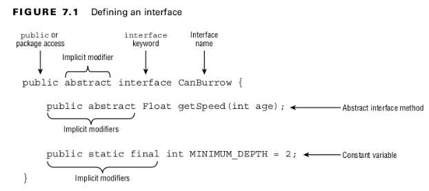

### Writing Simple Lambdas

- Classes can only extend one class, they had limited use for inheritance.
- A class may implement any number of interfaces.
-  An interface is an abstract data type that declares a list of abstract methods that any class implementing the interface must provide.
<br>

### Declaring and Using an Interface

<br>

- Interfaces are not required to define any methods.
```
public abstract interface WalksOnTwoLegs {}
```
<br>

- An interface cannot be instantiated
```
public class Biped {
    public static void main(String[] args) {
        var e = new WalksOnTwoLegs(); // DOES NOT COMPILE
    }
}
```
<br>

- ***interfaces*** cannot be marked as final for the same reason that abstract classes cannot be marked as final.
```
public final interface WalksOnEightLegs {} // DOES NOT COMPILE
```
<br>


<br>

- The FieldMouse class declares that it implements the Climb interface and includes an overridden version of getSpeed() inherited from the Climb interface.
- The method signature of getSpeed() matches exactly.
- The return type is covariant, since a Float can be implicitly cast to a Number.
- The access modifier of the interface method is implicitly public in Climb.
- A class can implement multiple interfaces, each separated by a comma (,).
<br>

#### Extending an Interface
- Like a class, an interface can extend another interface using the extends keyword.
- Extending two interfaces is permitted because interfaces are not initialized as part of a class hierarchy. Unlike abstract classes, they do not contain constructors and are not part of instance initialization. Interfaces simply define a set of rules and methods that a class implementing them must follow.
```
public interface Nocturnal {}
public interface HasBigEyes extends Nocturnal {}
```
<br>

#### Inheriting an Interface
- Like an abstract class, when a concrete class inherits an interface, all of the inherited abstract methods must be implemented.
  
<br>

#### Mixing Class and Interface Keywords
- A class can implement an interface.
- A class cannot extend an interface.
- an interface can extend another interface.
- an interface cannot implement another interface.
<br>


#### Inheriting Duplicate Abstract Methods
```
public interface Herbivore { public void eatPlants(); }
public interface Omnivore { public void eatPlants(); }

public class Bear implements Herbivore, Omnivore {
    public void eatPlants() {
        System.out.println("Eating plants");
    }
}
```
<br>

- The following is an example of an incompatible declaration:
```
public interface Herbivore { public void eatPlants(); }
public interface Omnivore { public int eatPlants(); }

public class Tiger implements Herbivore, Omnivore { // DOES NOT COMPILE
    ...
}
```
<br>

#### Inserting Implicit Modifiers
- Interfaces are implicitly abstract.
- Interface variables are implicitly public, static, and final.
- Interface methods without a body are implicitly abstract.
- Interface methods without the private modifier are implicitly public.
<br>

#### Declaring Concrete Interface Methods
#### Table: 7.1 Interface members types
|                       | Membership type | Required modifiers | Implicit modifiers          | Has value or body? |
|-----------------------|-----------------|--------------------|-----------------------------|--------------------|
| Constant variable     | Class           | -                  | public <br>static <br>final | Yes                |
| abstract method       | Instance        | -                  | public <br>abstract         | No                 |
| default method        | Instance        | default            | public                      | Yes                |
| static method         | Class           | static             | public                      | Yes                |
| private method        | Instance        | private            | -                           | Yes                |
| private static method | Class           | private <br>static | -                           | Yes                |
<br>

- A method with a membership type of class is shared among all instances of the interface.
- a method with a membership type of instance is associated with a particular instance of the interface.
<br>

### Writing a default Interface Method
- A default method is a method defined in an interface with the default keyword and includes a method body. It may be optionally overridden by a class implementing the interface.
<br>

#### Default Interface Method Definition Rules
1. A default method may be declared only within an interface.
2. A default method must be marked with the default keyword and include a method body.
3. A default method is implicitly public.
4. A default method cannot be marked abstract, final, or static.
5. A default method may be overridden by a class that implements the interface.
6. If a class inherits two or more default methods with the same method signature, then the class must override the method.
<br>

### Declaring static Interface Methods
#### Static Interface Method Definition Rules
1. A static method must be marked with the static keyword and include a method body.
2. A static method without an access modifier is implicitly public.
3. A static method cannot be marked abstract or final.
4. A static method is not inherited and cannot be accessed in a class implementing the interface without a reference to the interface name.
<br>

### Reusing Code with private Interface Methods
#### Private Interface Method Definition Rules
1. A private interface method must be marked with the private modifier and include a method body.
2. A private static interface method may be called by any method within the interface definition.
3. A private interface method may only be called by default and other private non-static methods within the interface definition.
<br>

### Reviewing Interface Members
#### Table: 7.2 Interface members types
|                       | Accessible from default and private methods within the interface? | Accessible from static methods with the interface? | Accessible from methods in classes inheriting the interface? | Accessible without an instance of the interface? |
|-----------------------|-------------------------------------------------------------------|----------------------------------------------------|--------------------------------------------------------------|--------------------------------------------------|
| Constant variable     | Yes                                                               | Yes                                                | Yes                                                          | Yes                                              |
| abstract method       | Yes                                                               | No                                                 | Yes                                                          | No                                               |
| default method        | Yes                                                               | No                                                 | Yes                                                          | No                                               |
| static method         | Yes                                                               | Yes                                                | Yes (Interface name required)                                | Yes (Interface name required)                    |
| private method        | Yes                                                               | No                                                 | No                                                           | No                                               |
| private static method | Yes                                                               | Yes                                                | No                                                           | No                                               |
<br>

### Working with Enums
#### Creating Simple Enums

<br>

- You can use equals() or == to compare enums
```
var s = Season.SUMMER;
System.out.println(Season.SUMMER); // SUMMER
System.out.println(s == Season.SUMMER); // true
```

- The values in an enum are fixed.
- You cannot add more by extending the enum.

```
public enum ExtendedSeason extends Season {} // DOES NOT COMPILE
```
<br>

#### Calling the values(), name(), and ordinal() Methods
- values() method to get an array of all of the values.
```
for(var season: Season.values()) {
    System.out.println(season.name() + " " + season.ordinal());
}
```

- Are listed in the order in which they are declared
<br>

### Calling the valueOf () Method

#### Using Enums in switch Statements
- Enums can be used in switch statements and expressions.
<br>

#### Adding Constructors, Fields, and Methods

- All enum constructors are implicitly private
- You can’t extend an enum and the constructors can be called only within the enum itself.
- An enum constructor will not compile if it contains a public or protected modifier.
- An enum can even implement an interface, as this just requires overriding the abstract methods.
<br>

```
public interface Weather { int getAverageTemperature(); }

public enum Season implements Weather {
    WINTER, SPRING, SUMMER, FALL;
    public int getAverageTemperature() { return 30; }
}
```

### Sealing Classes
- A sealed class declares a list of classes that can extend it, while the subclasses declare that they extend the sealed class.

<br>

#### Sealed Class Keywords
```
public interface Weather { int getAverageTemperature(); }

public enum Season implements Weather {
    WINTER, SPRING, SUMMER, FALL;
    public int getAverageTemperature() { return 30; }
}
```
<br>

- ***sealed***: Indicates that a class or interface may only be extended/implemented by named classes or interfaces
- ***permits***: Used with the sealed keyword to list the classes and interfaces allowed
- ***non-sealed***: Applied to a class or interface that extends a sealed class, indicating that it can be extended by unspecified classes
<br>

#### Compiling Sealed Classes
- A sealed class needs to be declared (and compiled) in the same package as its direct subclasses.
<br>

#### Specifying the Subclass Modifier
- Every class that directly extends a sealed class must specify exactly one of the following three modifiers: ***final***, ***sealed***, or ***non-sealed***.
<br>

#### A non-sealed Subclass
- The non-sealed modifier is used to open a sealed parent class to potentially unknown subclasses.
<br>

#### Omitting the permits Clause
```
// Snake.java
public sealed class Snake permits Cobra {}
final class Cobra extends Snake {}


// Snake.java
public sealed class Snake {
    final class Cobra extends Snake {}
}
```
<br>

#### Table: 7.3 Usage of the permits clause in sealed classes
| Location of direct subclasses             | permits clause             |
|-------------------------------------------|----------------------------|
| In a different file from the sealed class | Required                   |
| In the same files as the sealed class     | Permitted, but no required |
| Nested inside of the sealed class         | Permitted, but no required |
<br>

#### Sealing Interfaces
- interfaces can also be sealed.
- The sealed interface must appear in the same package or named module as the classes or interfaces that directly extend or implement it.
- a sealed interface is that the permits list can apply to a class that implements the interface or an interface that extends the interface.
- interfaces that extend a sealed interface can only be marked sealed or non-sealed. They cannot be marked final.
<br>

### Reviewing Sealed Class Rules
#### Sealed Class Rules

- Sealed classes are declared with the sealed and permits modifiers.
- Sealed classes must be declared in the same package or named module as their direct subclasses.
- Direct subclasses of sealed classes must be marked final, sealed, or non-sealed.
- The permits clause is optional if the sealed class and its direct subclasses are declared within the same file or the subclasses are nested within the sealed class.
- Interfaces can be sealed to limit the classes that implement them or the interfaces that extend them.
<br>

#### Encapsulating Data with Records
- implemented by declaring all instance variables ***private***.
<br>

#### Applying Records

<br>
- A record is a special type of data-oriented class in which the compiler inserts boilerplate code for you.
- The compiler inserts useful implementations of the Object methods equals(), hashCode(), and toString().
- it creates a constructor for you with the parameters in the same order in which they appear in the record declaration.
- For each field, it also creates an accessor as the field name, plus a set of parentheses. Unlike traditional POJOs or JavaBeans, the methods don’t have the prefix get or is .
<br>

#### Members Automatically Added to Records
- ***Constructor***: A constructor with the parameters in the same order as the record declaration
- ***Accessor method***: One accessor for each field
- ***equals()***: A method to compare two elements that returns true if each field is equal in terms of equals()
- ***hashCode()***: A consistent hashCode() method using all of the fields
- ***toString()***: A toString() implementation that prints each field of the record in a convenient, easy-­to-­read format.
- It is legal to have a record without any fields.
<br>
```
public record Crane() {}
```
<br>

#### Understanding Record Immutability
- That means you can’t extend or inherit a record.
- A record can implement a regular or sealed interface, provided it implements all of the abstract methods.
<br>
 
### Declaring Constructors
#### The Long Constructor
- We can just declare the constructor the compiler normally inserts automatically, which we refer to as the long constructor.
- The compiler will not insert a constructor if you define one with the same list of parameters in the same order. Since each field is final, the constructor must set every field.
<br>

#### Compact Constructors
- A compact constructor is a special type of constructor used for records to process validation and transformations succinctly.

<br>
- Java will execute the full constructor after the compact constructor.
- A ***compact constructor*** is declared without parentheses,
- ***Compact constructors*** give you the opportunity to apply transformations to any of the input values.
- ***Compact constructors*** can modify the constructor parameters, they cannot modify the fields of the record.
<br>

#### Overloaded Constructors
- The first line of an overloaded constructor must be an explicit call to another constructor via this().
```
public record Crane(int numberEggs, String name) {
    public Crane(String firstName, String lastName) {
        this(0, firstName + " " + lastName);
    }
}
```
<br>

#### Customizing Records
- Overloaded and compact constructors
- Instance methods including overriding any provided methods (accessors, equals(), hashCode() , toString() )
- Nested classes, interfaces, annotations, enum, and records
- you can add methods, static fields, and other data types, you cannot add instance fields outside the record declaration, even if they are private.
- Do not support instance initializers. All initialization for the fields of a record must happen in a constructor.
<br>

## Creating Nested Classes
- ***Inner class***: A non-static type defined at the member level of a class
- ***Static nested class***: A static type defined at the member level of a class
- ***Local class***: A class defined within a method body
- ***Anonymous class***: A special case of a local class that does not have a name
All four types of nested classes can now define static variables and methods!
<br>

#### Declaring an Inner Class
Also called a member inner class.
Inner classes have the following properties:
- Can be declared public, protected, package, or private
- Can extend a class and implement interfaces
- Can be marked abstract or final
- Can access members of the outer class, including private members.
<br>

#### static Nested Class
- The nesting creates a namespace because the enclosing class name must be used to refer to it.
- It can additionally be marked private or protected.
- The enclosing class can refer to the fields and methods of the static nested class.
<br>
```
public class Park {
    static class Ride {
        private int price = 6;
    }

    public static void main(String[] args) {
        var ride = new Ride();
        System.out.println(ride.price);
    }
}
```
<br>

#### Local Class
A local class is a nested class defined within a method. Like local variables, a local class declaration does not exist until the method is invoked
Local classes have the following properties:
- They do not have an access modifier.
- They can be declared final or abstract .
- They have access to all fields and methods of the enclosing class (when defined in an instance method).
- They can access final and effectively final local variables.
<br>

#### Anonymous Class
An anonymous class is a specialized form of a local class that does not have a name.
```
public class ZooGiftShop {
    abstract class SaleTodayOnly {
        abstract int dollarsOff();
    }

    public int admission(int basePrice) {
        SaleTodayOnly sale = new SaleTodayOnly() {
            int dollarsOff() { return 3; }
        }; // Don't forget the semicolon!
        return basePrice -­ sale.dollarsOff();
    }
}
```
<br>

### Reviewing Nested Classes
#### Table 7.4 Modifiers in nested classes
| Permitted modifiers | Inner class | static nested class | Local class | Anonymous class |
|---------------------|-------------|---------------------|-------------|-----------------|
| Access modifiers    | All         | All                 | None        | None            |
| abstract            | Yes         | No                  | Yes         | No              |
| final               | Yes         | OUT                 | Yes         | No              |
<br>

#### Table 7.5 Modifiers in nested classes
|                                                          | Inner class | static nested class | Local class                            | Anonymous class                                      |
|----------------------------------------------------------|-------------|---------------------|----------------------------------------|------------------------------------------------------|
| Can extend a class or implement any number of interfaces | Yes         | All                 | Yes                                    | No-must have exactly one superclass or one interface |
| abstract                                                 | Yes         | No                  | Yes(if declared in an instance method) | Yes(if declared in an instance method)               |
| final                                                    | N/A         | N/A                 | Yes(if final or effectively final)     | Yes(if final or effectively final)                   |
<br>

## Understanding Polymorphism
- A reference with the same type as the object
- A reference that is a superclass of the object
- A reference that defines an interface the object implements or inherits
- A cast is not required if the object is being reassigned to a supertype or interface of the object.
- only the methods and variables available to that reference type are callable on the object without an explicit cast.
<br>

#### Object vs. Reference
- The type of the object determines which properties exist within the object in memory.
- The type of the reference to the object determines which methods and variables are accessible to the Java program.
<br>

#### Casting Objects
- Casting a reference from a subtype to a supertype doesn’t require an explicit cast.
- Casting a reference from a supertype to a subtype requires an explicit cast.
- At runtime, an invalid cast of a reference to an incompatible type results in a ClassCastException being thrown.
- The compiler disallows casts to unrelated types.
<br>

#### Polymorphism and Method Overriding
- Polymorphism’s ability to replace methods at runtime via overriding is one of the most important properties of Java.

