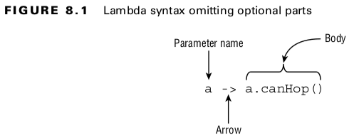
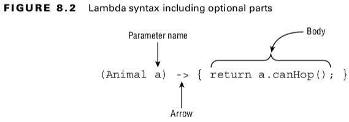

## Writing Simple Lambdas

<br>


<br>

#### Table: 8.1 Valid lambdas that return a boolean
| Lambda                                       | # of parameters |
|----------------------------------------------|-----------------|
| () -> true                                   | 0               |
| x -> x.startWith("test")                     | 1               |
| (String x) -> x.startsWith("test")           | 1               |
| (x, y) -> { return x.startsWith("test"); }   | 2               |
| (String x, String y) -> x.startsWith("test") | 2               |
<br>

- A single parameter specified with the name a and stating that the type is Animal.
- The arrow operator ( -> ) to separate the parameter and body.
- A body that has one or more lines of code, including a semicolon and a return statement.
  <br>

#### Table: 8.2 Invalid lambdas that should return a boolean
| Lambda                                 | # of parameters                 |
|----------------------------------------|---------------------------------|
| x, y -> x.startsWith("fish")           | Missing parentheses on left     |
| x -> { x.startWith("camel"); }         | Missing return on right         |
| x ->{ return x.startsWith("giraffe") } | Missing semicolon inside braces |
| String x -> x.endsWith("eagle")        | Missing parentheses on left     |
<br>

- The parentheses are optional only when there is one parameter and it doesn’t have a type declared.
  <br>

### Coding Functional Interfaces

- A functional interface is an interface that contains a single abstract method.
  <br>

#### Adding Object Methods
- All classes inherit certain methods from Object.
```
public String toString();
public boolean equals(Object);
public int hashCode();
```
<br>

#### Using Method References
- ***Method references*** are another way to make the code easier to read, such as simply mentioning the name of the method.
- LearnToSpeak learner = System.out::println;
- The :: operator tells Java to call the println() method later. It will take a little while to get used to the syntax. Once you do, you may find your code is shorter and less distracting without writing as many lambdas.
  <br>

There are four formats for method references:
- static methods
- Instance methods on a particular object
- Instance methods on a parameter to be determined at runtime
- Constructors
  <br>

#### Reviewing Method References
#### Table: 8.3 Method references
| Type                                    | Before Colon           | After Colon | Example         | 
|-----------------------------------------|------------------------|-------------|-----------------|
| static methods                          | Class name             | Method name | Math::random    | 
| Instance methods on a particular object | Instance variable name | Method name | str::startsWith | 
| Instance methods on a parameter         | Class name             | Method name | String::isEmpty | 
| Constructor                             | Class name             | new         | String::new     | 

<br>

#### Working with Built-in Functional Interfaces
#### Table: 8.4 Common functional interfaces
| Functional Interface | Return type | Method name  | # of parameters | 
|----------------------|-------------|--------------|-----------------|
| Supplier<T>          | T           | get()        | 0               | 
| Consumer<T>          | void        | accept(T)    | 1(T)            | 
| BiConsumer<T, U>     | void        | accept(T, U) | 2(T, U)         | 
| Predicate<T>         | boolean     | test(T)      | 1(T)            | 
| BiPredicate<T, U>    | boolean     | test(T, U)   | 2(T, U)         |
| Function<T, R>       | R           | apply(T)     | 1(T)            |
| BiFunction<T, U, R>  | R           | apply(T, U)  | 2(T, U)         |
| UnaryOperator<T>     | T           | apply(T)     | 1(T)            |
| BinaryOperator<T>    | T           | apply(T, U)  | 2(T, T)         |
<br>

#### Implementing Supplier
- A Supplier is used when you want to generate or supply values without taking any input.

```
@FunctionalInterface
public interface Supplier<T> {
    T get();
}

Supplier<LocalDate> s1 = LocalDate::now;
Supplier<LocalDate> s2 = () -­> LocalDate.now();

Supplier<StringBuilder> s1 = StringBuilder::new;
Supplier<StringBuilder> s2 = () -­> new StringBuilder();
```
<br>

#### Implementing Consumer and BiConsumer
- You use a Consumer when you want to do something with a parameter but not return anything.

```
@FunctionalInterface
public interface Consumer<T> {
    void accept(T t); // omitted default method
}

@FunctionalInterface
public interface BiConsumer<T, U> {
    void accept(T t, U u); // omitted default method
}

Consumer<String> c1 = System.out::println;
Consumer<String> c2 = x -> System.out.println(x);

BiConsumer<String, Integer> b1 = map::put;
BiConsumer<String, Integer> b2 = (k, v) -> map.put(k, v);
```
<br>

#### Implementing Predicate and BiPredicate

- Predicate is often used when filtering or matching. A BiPredicate is just like a Predicate, except that it takes two parameters instead of one.
```
@FunctionalInterface
public interface Predicate<T> {
    boolean test(T t); // omitted default and static methods
}

@FunctionalInterface
public interface BiPredicate<T, U> {
    boolean test(T t, U u); // omitted default methods
}

Predicate<String> p1 = String::isEmpty;
Predicate<String> p2 = x -> x.isEmpty();

BiPredicate<String, String> b1 = String::startsWith;
BiPredicate<String, String> b2 = (string, prefix) -> string.startsWith(prefix);
```
<br>

#### Implementing Function and BiFunction
- A ***Function*** is responsible for turning one parameter into a value of a potentially different type and returning it.
```
@FunctionalInterface
public interface Function<T, R> {
    R apply(T t); // omitted default and static methods
}

@FunctionalInterface
public interface BiFunction<T, U, R> {
    R apply(T t, U u); // omitted default method
}

Function<String, Integer> f1 = String::length;
Function<String, Integer> f2 = x -> x.length();

BiFunction<String, String, String> b1 = String::concat;
BiFunction<String, String, String> b2 = (string, toAdd) -> string.concat(toAdd);
```
<br>

#### Implementing UnaryOperator and BinaryOperator
- They require all type parameters to be the same type. 
- A ***UnaryOperator*** transforms its value into one of the same type.
- A ***BinaryOperator*** merges two values into one of the same type.
```
@FunctionalInterface
public interface UnaryOperator<T> extends Function<T, T> {
    // omitted static method
}


@FunctionalInterface
public interface BinaryOperator<T> extends BiFunction<T, T, T> {
    // omitted static methods
}


T apply(T t); // UnaryOperator

UnaryOperator<String> u1 = String::toUpperCase;
UnaryOperator<String> u2 = x -> x.toUpperCase();


T apply(T t1, T t2); // BinaryOperator

BinaryOperator<String> b1 = String::concat;
BinaryOperator<String> b2 = (string, toAdd) -> string.concat(toAdd);
```
<br>

#### Using Convenience Methods on Functional Interfaces
#### Table: 8.5 Convenience Methods on Functional Interfaces
| Functional Interface | Return type | Method name | # of parameters | 
|----------------------|-------------|-------------|-----------------|
| Consumer             | Consumer    | andThen()   | Consumer        | 
| Function             | Function    | andThen()   | Function        | 
| Function             | Function    | compose()   | Function        | 
| Predicate            | Predicate   | and()       | Predicate       | 
| Predicate            | Predicate   | negate()    | -               |
| Predicate            | Predicate   | or(T)       | Predicate       |
<br>

#### Learning the Functional Interfaces for Primitives
#### Table: 8.6 Common functional interfaces for primitives
| Functional Interface                                              | Return type             | Method name                                  | # of parameters                  | 
|-------------------------------------------------------------------|-------------------------|----------------------------------------------|----------------------------------|
| DoubleSupplier <br>IntSupplier <br>LongSupplier                   | double <br>int <br>long | getAsDouble <br>getAsInt <br>getAsLong       | 0                                | 
| DoubleConsumer <br>IntConsumer <br>LongConsumer                   | void                    | accept                                       | 1(double) <br>1(int) <br>1(long) | 
| DoublePredicate <br>IntPredicate <br>LongPredicate                | boolean                 | test                                         | 1(double) <br>1(int) <br>1(long) | 
| DoubleFunction <br>IntFunction <br>LongFunction                   | R                       | apply                                        | 1(double) <br>1(int) <br>1(long) | 
| DoubleUnaryOperator <br>IntUnaryOperator <br>LongUnaryOperator    | double <br>int <br>long | applyAsDouble <br>applyAsInt <br>applyAsLong | 1(double) <br>1(int) <br>1(long) |
| DoubleBinaryOperator <br>IntBinaryOperator <br>LongBinaryOperator | double <br>int <br>long | applyAsDouble <br>applyAsInt <br>applyAsLong | 2(double) <br>2(int) <br>2(long) |
<br>

#### Working with Variables in Lambdas
- They can appear in three places with respect to lambdas: the parameter list, local variables declared inside the lambda body, and variables referenced from the lambda body.

#### Table: 8.7 Primitive-specific functional interfaces
| Functional Interface                                                                                                                         | Return type                                         | Method name                                                                                   | # of parameters                                                       | 
|----------------------------------------------------------------------------------------------------------------------------------------------|-----------------------------------------------------|-----------------------------------------------------------------------------------------------|-----------------------------------------------------------------------|
| ToDoubleFunction<T> <br>ToIntFunction<T> <br>ToLongFunction<T>                                                                               | double <br>int <br>long                             | applyAsDouble <br>applyAsInt <br>applyAsLong                                                  | 1(T)                                                                  | 
| ToDoubleBiFunction<T, U> <br>ToIntBiFunction<T, U> <br>ToLongBiFunction<T, U>                                                                | double <br>int <br>long                             | applyAsDouble <br>applyAsInt <br>applyAsLong                                                  | 2(T, U)                                                               | 
| DoubleToIntFunction <br>DoubleToLongFunction <br>IntToDoubleFunction <br>IntToLongFunction<T> <br>LongToDoubleFunction <br>LongToIntFunction | int <br>long <br>double <br>long <br>double <br>int | applyAsInt <br>applyAsLong <br>applyAsDouble <br>applyAsLong <br>applyAsDouble <br>applyAsInt | 1(double) <br>1(double) <br>1(int) <br>1(int) <br>1(long) <br>1(long) | 
| ObjDoubleConsumer<T> <br>ObjIntConsumer<T> ObjLongConsumer<T>                                                                                | void                                                | accept                                                                                        | 2(T, double) <br>2(T, int) <br>2(T, long)                             | 
<br>

#### Listing Parameters
- var can be used in place of the specific type.
```
Predicate<String> p = x -> true;
Predicate<String> p = (var x) -> true;
Predicate<String> p = (String x) -> true;
```
<br>

- The compiler requires all parameters in the lambda to use the same format
```
(var x, y) -> "Hello" // DOES NOT COMPILE
(var x, Integer y) -> true // DOES NOT COMPILE
(String x, var y, Integer z) -> true // DOES NOT COMPILE
(Integer x, y) -> "goodbye" // DOES NOT COMPILE
```
<br>

#### Referencing Variables from the Lambda Body
- This shows that a lambda can access an instance variable, method parameter, or local variable under certain conditions. Instance variables (and class variables) are always allowed.
- The only thing lambdas cannot access are variables that are not final or effectively final.