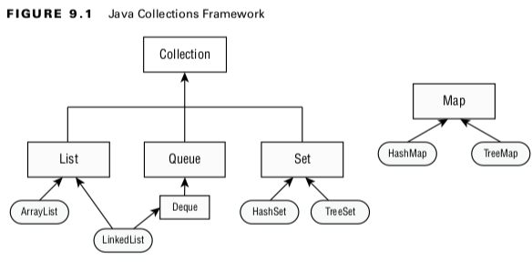
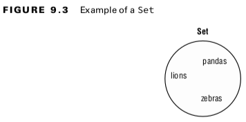
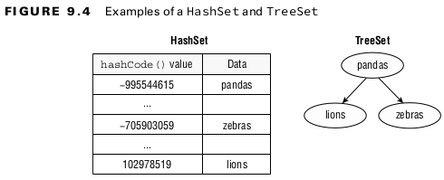
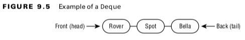
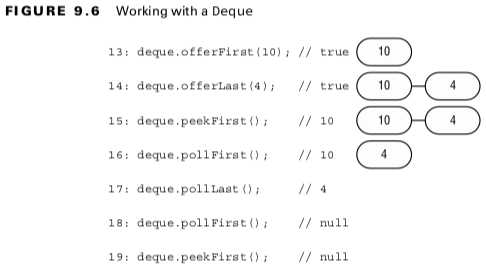
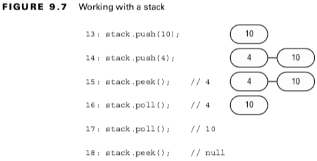
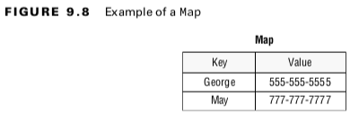
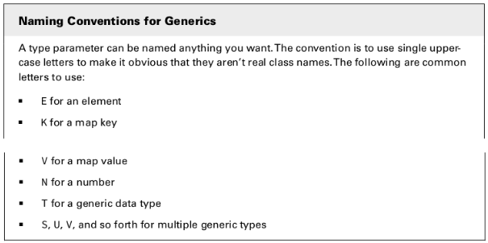

## Using Common Collection APIs
- ***List***: A list is an ordered collection of elements that allows duplicate entries. Elements in a list can be accessed by an int index.
- ***Set***: A set is a collection that does not allow duplicate entries.
- ***Queue***: A queue is a collection that orders its elements in a specific order for processing. A Deque is a subinterface of Queue that allows access at both ends.
- ***Map***: A map is a collection that maps keys

<br>

### Using the Diamond Operator
The ***diamond operator***(<>) is a shorthand notation that allows you to omit the generic type from the right side of a statement when the type can be inferred.
```
List<Integer> list = new ArrayList<>();
Map<Long,List<Integer>> mapOfLists = new HashMap<>();
Removing with Conditions
```
<br>

- The ***removeIf()*** method removes all elements that match a condition.
```
public boolean removeIf(Predicate<? super E> filter);
```
<br>

## Using the List Interface
#### Table 9.1 Factory methods to create a List
| Method                  | Description                                                     | Can add elements? | Can replace elements? | Can delete elements? |
|-------------------------|-----------------------------------------------------------------|-------------------|-----------------------|----------------------|
| Arrays.asList(varargs)  | Return fixed size list backend by an array                      | No                | Yes                   | No                   |
| List.of(varargs)        | Return immutable list                                           | No                | No                    | No                   |
| List.copyOf(collection) | Return immutable list with copy of original collection's values | No                | No                    | No                   |
<br>

#### Working with List Methods
#### Table: 9.2 List methods
| Method                                                     | Description                                                                                          |
|------------------------------------------------------------|------------------------------------------------------------------------------------------------------|
| public boolean ***add***(E element)                        | Adds element to end(available on all Collection APIs)                                                |
| public void ***add***(int index, E element)                | Adds element at index and moves the rest toward the end                                              |
| public E ***get***(int index)                              | Returns element at index                                                                             |
| public E ***remove***(int index)                           | Removes element at index and moves the rest toward the front                                         |
| public default void ***replaceAll***(UnaryOperator <E> op) | Replaces each element in list with result of operator                                                |
| public E ***set***(int index, E e)                         | Replaces element at index and returns original. Throws IndexOutOfBoundsException if index is invalid |
| public default void ***sort***(Comparator<? super E> c)    | Sorts list. We cover this later in the chapter in the "Sorting Data" sections.                       |
<br>

#### Using the Set Interface

<br>

- A ***TreeSet*** stores its elements in a sorted tree structure.
- Not allow duplicate data.
<br>


<br>

#### Using the Queue and Deque Interfaces
- ***FIFO*** (first-in, first-out) queue.
<br>


<br>

#### Working with Queue and Deque Methods
#### Table: 9.3 Queue methods
| Functionality             | Methods                                               |
|---------------------------|-------------------------------------------------------|
| Add to back               | public boolean add(E e) <br>public boolean offer(E e) |
| Read from front           | public E element() <br>public E peek()                |
| Get and remove from front | public E remove() <br>public E poll()                 |
<br>

#### Table: 9.4 Dequeue methods
| Functionality             | Methods                                                      |
|---------------------------|--------------------------------------------------------------|
| Add to front              | public void addFirst(E e) <br>public boolean offerFirst(E e) |
| Add to back               | public void addLast(E e) <br>public boolean offerLast(E e)>  |
| read from front           | public E getFirst() <br>public E peekFirst()                 |
| read from back            | public E getLast() <br>public E peekLast()                   |
| Get and remove from front | public E removeFirst() <br>public E pollFirst()              |
| Get and remove from front | public E removeLast() <br>public E pollLast()                |
<br>


<br>

#### Table: 9.5 Using a Deque as a stack
| Functionality             | Methods               |
|---------------------------|-----------------------|
| Add to the front/top      | public void push(E e) |
| remove from the front/top | public E pop()        |
| Get first element         | public E peek()       |
<br>


<br>

#### Using the Map Interface

<br>

#### Working with Map Methods
#### Table: 9.6 Map methods
| Method                                                   | Description                                                                                               |
|----------------------------------------------------------|-----------------------------------------------------------------------------------------------------------|
| public void clear()                                      | Removes all keys and values from map.                                                                     |
| public boolean containsVKey(Object key)                  | Returns whether key is in map.                                                                            |
| public boolean containsValue(Object value)               | Returns whether value is map.                                                                             |
| public set<Map.Entry<k,v>> entrySet()                    | Returns Set of key/value pairs.                                                                           |
| public void forEach(BiConsumer<K key, V value>)          | Loops through each key/value pair.                                                                        |
| public V get(Object key)                                 | Returns value mapped by key or null if none is mapped.                                                    |
| public V getOrDefault(Object key, v defaultValue)        | Returns value mapped by key or default value if none es mapped.                                           |
| public boolean isEmpty()                                 | Returns whether map is empty.                                                                             |
| public Set<K> keySet()                                   | Returns set of all keys.                                                                                  |
| public V merge(K key, V value, Function(<V, V, V> func)) | Sets value if key not set. Runs function is key es set, to determine new value. Removes if value is null. |
| public V put(K key, V value)                             | Adds or replaces key/value pair. Returns previous value or null.                                          |
| public V putIfAbsent(K key, v value)                     | Adds value if key not present and returns null.Otherwise, returns existing value.                         |
| public V remove(Object key)                              | Removes an returns value mapped to key. Returns null if none.                                             |
| public V replace(K key, V value)                         | Replaces value for given key if key is set. Returns original value or null if none.                       |
| public void replaceAll(BiFunction<K, V, V> func)         | Replaces each value with results of function.                                                             |
| public int size()                                        | Returns number of entries(key/value pairs) in map.                                                        |
| public Collection<V> values()                            | Returns Collection of all values.                                                                         |

#### Merging Data
```
BiFunction<String, String, String> mapper = (v1, v2) -> v1.length()> v2.length() ? v1: v2;

Map<String, String> favorites = new HashMap<>();
favorites.put("Jenny", "Bus Tour");
favorites.put("Tom", "Tram");

String jenny = favorites.merge("Jenny", "Skyride", mapper);
String tom = favorites.merge("Tom", "Skyride", mapper);

System.out.println(favorites); // {Tom=Skyride, Jenny=Bus Tour}
System.out.println(jenny); // Bus Tour
System.out.println(tom); // Skyride
```
<br>

- The ***merge()*** method also has logic for what happens if null values or missing keys are involved. In this case, it doesn’t call the BiFunction at all, and it simply uses the new value.
- The ***mapping function*** is used only when there are two actual values to decide between.
- ***merge()*** is what happens when the mapping function is called and returns null. The key is removed from the map when this happens
<br>

#### Table: 9.7 Behavior of the merge() method
| if the requested key___     | And mapping function returns__    | Then:                                                                | 
|-----------------------------|-----------------------------------|----------------------------------------------------------------------|
| Has a null value in map     | N/A (mapping function not called) | Update key's value in map with value parameter                       | 
| Has a non-null value in map | null                              | Remove key from map                                                  | 
| Has a non-null value in map | a non-null value                  | Set key to mapping function result                                   | 
| Is not in map               | N/A (mapping function not called) | Add key with value parameter to map directly without calling mapping |
<br>

#### Comparing Collection Types
#### Table: 9.8 Java Collection Framework types
| Type  | Can contain duplicate elements? | Elements always ordered?        | Has keys and values? | Must add/remove in specific order? |
|-------|---------------------------------|---------------------------------|----------------------|------------------------------------|
| List  | Yes                             | Yes(by index)                   | No                   | No                                 |
| Map   | Yes(for values)                 | No                              | Yes                  | No                                 |
| Queue | Yes                             | Yes(retrieved in defined order) | No                   | Yes                                |
| Set   | No                              | No                              | No                   | No                                 |
<br>

## Sorting Data

#### Creating a Comparable Class
```
public interface Comparable<T> {
    int compareTo(T o);
}

public int compareTo(Duck d) {
    return name.compareTo(d.name); // sorts ascendingly by name
}
```
<br>

- id - a.id sorts in ***ascending order***, and a.id - id sorts in ***descending order***.
- There are three rules to know:
- The number 0 is returned when the current object is equivalent to the argument to compareTo().
- A negative number (less than 0) is returned when the current object is smaller than the argument to compareTo().
- A positive number (greater than 0) is returned when the current object is larger than the argument to compareTo().
<br>

#### Keeping compareTo() and equals() Consistent
- The ***compareTo() method*** returns 0 if two objects are equal, equals() method returns true if two objects are equal.
- A natural ordering that uses compareTo() is said to be consistent with equals if, and only if, x.equals(y) is true whenever x.compareTo(y) equals 0.
- x.equals(y) must be false whenever x.compareTo(y) is not 0.
<br>

## Comparing Data with a Comparator
```
import java.util.Comparator;

Comparator<Duck> byWeight = new Comparator<Duck>() {
    public int compare(Duck d1, Duck d2) {
        return d1.getWeight()- d2.getWeight();
    }
};
```
<br>

#### Collections.sort(ducks, byWeight);
- Comparable can be used without an import statement, while Comparator cannot.
```
Comparator<Duck> byWeight = (d1, d2) -> d1.getWeight() - d2.getWeight();
Comparator<Duck> byWeight = Comparator.comparing(Duck::getWeight);
```
<br>

#### Table 9.10 Comparison of Comparable and Comparator
| Difference                                        | Comparable  | Comparator |  
|---------------------------------------------------|-------------|------------|
| Package name                                      | java.lang   | java.util  | 
| Interface must be implemented by class comparing? | Yes         | No         |  
| Method name in interface                          | compareTo() | compare()  |  
| Number of parameters                              | 1           | 2          | 
| Common to declare using lambda                    | No          | Yes        | 
<br>

#### Table: 9.11 Helper static methods for building a Comparator
| Method                    | Description                                                                                |
|---------------------------|--------------------------------------------------------------------------------------------|
| Comparing(function)       | Compare by results of function that returns any Object (or primitive outboxed int Object). |
| ComparingDouble(function) | Compare by results of function that returns double.                                        |
| ComparingInt(function)    | Compare by results of function that returns int.                                           |
| ComparingLong(function)   | Compare by results of function that returns long                                           |
| naturalOrder()            | Sort using order specified by the Comparable implementation on object itself.              |
| naturalOrder()            | Sort using reverse of order specified by Comparable implementation on object itself.       |
<br>

#### Table: 9.12 Helper default methods for building a Comparator
| Method                        | Description                                                                                                                 |
|-------------------------------|-----------------------------------------------------------------------------------------------------------------------------|
| reversed()                    | Reverse order of chained comparator.                                                                                        |
| thenComparing(function)       | If previous Comparator return 0, use this comparator that returns Object or can be autoboxed int one.                       |
| thenComparingDouble(function) | If previous Comparator return 0, use this comparator that returns double. Otherwise, return value from previous Comparator. |
| thenComparingInt(function)    | If previous Comparator return 0, use this comparator that returns int. Otherwise, return value from previous Comparator.    |
| thenComparingLong(function)   | If previous Comparator return 0, use this comparator that return long. Otherwise, return value from previous Comparator.    |
<br>

## Sorting and Searching
The ***Collections.sort()*** method uses the ***compareTo() method*** to sort.

#### Reviewing binarySearch()
### Table: 3.1 Binary search rules(1Z0-808)
| Scenario                                 | Result                                                                                                                      |
|------------------------------------------|-----------------------------------------------------------------------------------------------------------------------------|
| Target element found in sorted array     | Index of match                                                                                                              |
| Target element not found in sorted array | Negative value showing one smaller than the negative of index, where a match needs to be inserted to preserve sorted order. |
| Unsorted array                           | A surprise-this result isn predictable.                                                                                     |
<br>

- There is not a sort method on Set or Map . Both of those types are unordered, so it wouldn’t make sense to sort them.
<br>

#### Working with Generics

<br>

#### Bounding Generic Types
#### Table: 9.13 Type of bounds
| Type of bound             | Syntax       | Example                                                                | 
|---------------------------|--------------|------------------------------------------------------------------------|
| Unbounded wildcard        | ?            | List<***?***> a = new ArrayList<String>();                             | 
| Wildcard with upper bound | ? extends    | List<***? extends Exception***> a = new ArrayList<RuntimeException>(); | 
| Wildcard with lower bound | ? super type | List<***? super Exception***> a = new ArrayList<Object>();             |
<br>


#### Creating Unbounded Wildcards


#### Creating Upper-Bounded Wildcards
```
ArrayList<Number> list = new ArrayList<Integer>(); // DOES NOT COMPILE
List<? extends Number> list = new ArrayList<Integer>();
```
<br>

#### Creating Lower-Bounded Wildcards
```
ArrayList<Number> list = new ArrayList<Integer>(); // DOES NOT COMPILE
List<? extends Number> list = new ArrayList<Integer>();
```
<br>

#### Table: 15.3 SQL runnable by the execute method
| static void addSound(___ list){list.add("quack");} | Method compiles                          | Can pass a List<String>                   | Can pass a List<Object> | 
|----------------------------------------------------|------------------------------------------|-------------------------------------------|-------------------------|
| List<***?***>                                      | No(unbounded generics are immutable)     | Yes                                       | Yes                     | 
| List<***? extends object***>                       | No(upper-bounded generics are immutable) | Yes                                       | Yes                     | 
| List<***Object***>;                                | Yes                                      | No (with generics, must pass exact match) | Yes                     | 
| List<***? super String***>;                        | Yes                                      | Yes                                       | Yes                     | 
<br>